# Prompt Maker CLI (`@perceptron/prompt-maker-cli`)

Terminal-first prompt generator with a built-in Ink TUI. It turns rough intent + optional context (files, URLs, smart context, images, videos) into a structured **prompt contract**, with optional polishing, streaming telemetry, and automatic history logging.

Highlights:

- **Generate workflow**: run from flags or from the TUI.
- **Context ingestion**: file globs (`--context`), URLs (`--url`, including GitHub trees), optional smart context (`--smart-context`), and media (`--image`, `--video`).
- **Auditable runs**: token telemetry, token budgets (optional trimming), structured stream events (`--stream jsonl`), and JSONL history (`~/.config/prompt-maker-cli/history.jsonl`).
- **TUI-first**: `prompt-maker-cli` with no args launches the TUI.

The project is **TUI-first**:

- `prompt-maker-cli` with **no args** launches the TUI.
- Use the same pipelines via flags (`generate`) or tests (`test`) when you need automation.

## Table of Contents

- [Diagram Index](#diagram-index)
- [Quickstart](#quickstart)
- [CLI Modes and Routing](#cli-modes-and-routing)
- [TUI Mode (recommended)](#tui-mode-recommended)
  - [Launch](#launch)
  - [Keybindings](#keybindings)
  - [Input Routing Invariant](#input-routing-invariant)
  - [Command Palette (`/commands`)](#command-palette-commands)
  - [Series Generation (“atomic prompts”)](#series-generation-atomic-prompts)
  - [TUI Theming](#tui-theming)
- [Generate Mode (CLI)](#generate-mode-cli)
  - [Common Workflows](#common-workflows)
  - [Key Flags](#key-flags)
  - [Conceptual Architecture](#conceptual-architecture)
  - [Intent Intake](#intent-intake)
  - [Context Ingestion](#context-ingestion)
  - [Remote URL and GitHub Context](#remote-url-and-github-context)
  - [Smart Context (Local RAG)](#smart-context-local-rag)
  - [Media Attachments](#media-attachments)
  - [Streaming Events and Telemetry](#streaming-events-and-telemetry)
  - [Interactive Refinement](#interactive-refinement)
  - [Polish Pass](#polish-pass)
  - [Output Artifacts](#output-artifacts)
- [Prompt Tests](#prompt-tests)
- [TUI Architecture and UX Model](#tui-architecture-and-ux-model)
- [Provider Configuration](#provider-configuration)
- [Outputs and Persistence](#outputs-and-persistence)
- [Development](#development)
- [Maintainer References](#maintainer-references)
- [License](#license)

## Diagram Index

All diagrams are GitHub Mermaid compatible and grounded in:

- `docs/neovim-plugin-integration.md` (pipeline, streaming events, transports, context/media details)
- `docs/tui-design.md` (TUI architecture, UX invariants)
- This README’s CLI/TUI behavior sections

CLI + Generate Pipeline:

- [D1. CLI Routing Flow](#d1-cli-routing-flow) — how `ui` / `generate` / `test` are selected.
- [D2. Generate Pipeline Overview](#d2-generate-pipeline-overview) — end-to-end generate workflow, including interactive and polish.
- [D3. `--stream jsonl` Event Timeline](#d3---stream-jsonl-event-timeline) — typical JSONL event emission order.
- [D4. `--interactive-transport` Lifecycle](#d4---interactive-transport-lifecycle) — socket/pipe setup, commands, mirrored events.
- [D5. Interactive Phase State Machine](#d5-interactive-phase-state-machine) — phases emitted via `interactive.state`.

Context + Media:

- [D6. Context Ingestion Decision Tree](#d6-context-ingestion-decision-tree) — how sources merge and when failures warn vs fail.
- [D7. Smart Context Workflow](#d7-smart-context-workflow) — scan → cache/index → top‑k → de-dupe append.
- [D8. URL + GitHub Context Resolution](#d8-url--github-context-resolution) — remote fetch behavior and safety limits.
- [D9. Media Handling (Images + Videos)](#d9-media-handling-images--videos) — image parts vs video uploads and Gemini switching.

TUI:

- [D10. TUI Architecture Map](#d10-tui-architecture-map) — AppContainer + screens + popups + keymaps.
- [D11. TUI Input Routing Priority](#d11-tui-input-routing-priority) — help overlay > popup > screen > globals.

Other:

- [D12. `/series` Generation and Filesystem Outputs](#d12-series-generation-and-filesystem-outputs) — atomic prompt series, write-on-best-effort.
- [D13. Theme Resolution Precedence](#d13-theme-resolution-precedence) — theme search order and overriding.
- [D14. Prompt Test Runner Flow](#d14-prompt-test-runner-flow) — `test` mode and the TUI Test Runner view.

---

## Quickstart

From repo root:

```bash
npm ci
npm run build

# TUI (default if no args)
npm start

# Generate from a one-shot intent
npm start -- "Draft a confident onboarding-bot spec" --model gpt-4o-mini

# Explicit commands
npm start -- ui
npm start -- test prompt-tests.yaml
```

Global install from a local checkout:

```bash
npm install -g .

# Now you can run:
prompt-maker-cli
```

## CLI modes and routing

`prompt-maker-cli` has three top-level modes:

- `ui`: Ink TUI
- `generate` (default for non-`ui`/`test` args): prompt generation pipeline
- `test`: prompt test runner

Routing rules:

- No args → `ui`
- First arg `ui` → `ui`
- First arg `test` → `test`
- First arg `generate` or `expand` → `generate` (`expand` is an alias)
- Anything else (including flags like `--json`) → `generate`

### D1. CLI Routing Flow

Shows how argv maps to top-level modes.

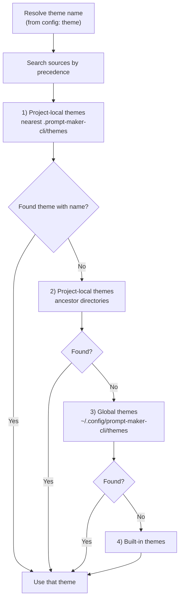

## TUI mode (recommended)

The Ink TUI is the fastest way to iterate on prompts interactively:

- One “generate” view with a scrollable history + a single input bar.
- Command palette + popups for models, context, settings, and themes.
- Built-in Test Runner view.
- Session-oriented UX (reuse last prompt, view token breakdown, show last reasoning, etc.).

Reference: `docs/tui-design.md`.

### Launch

```bash
# Default: the TUI (no args)
prompt-maker-cli

# Explicit entry
prompt-maker-cli ui

# Start TUI with an interactive transport socket/pipe
prompt-maker-cli ui --interactive-transport /tmp/pmc.sock
```

Important caveats:

- **TTY required**: Ink needs raw-mode input. Running the TUI without a real TTY will throw an Ink “Raw mode is not supported” error.
- **Platform/terminal support**: the TUI has only been tested on **macOS** using the **Kitty** terminal app. Running on Windows (or in other terminals) might pose problems.
- **Minimal arg parsing**: `ui` only parses `--interactive-transport`. `prompt-maker-cli ui --help` is not implemented.
- **FZF matching**: the TUI uses the npm `fzf` library for fuzzy matching (bundled via `npm install`; no separate `fzf` binary is required).

### Keybindings

Global keybinds:

- `Ctrl+G`: open command palette (Generate view)
- `Ctrl+T`: switch to Test Runner view
- `?`: toggle help overlay
- `Ctrl+C` or `/exit`: exit
- `Esc`: dismiss popups/menus (never exits)

Generate view:

- Type normal text + `Enter`: generate
- Type `/`: enter command mode (filters the palette)
- `↑/↓`: scroll history (when no help/popup is active)
- `Tab`:
  - If the input looks like a dropped absolute file path, it adds that file as context.
  - Otherwise, it opens the `/series` flow.

Test Runner view:

- `Tab` / `Shift+Tab`: change focus
- `Enter`:
  - in file input: moves focus to actions
  - in actions: runs tests

### Input routing invariant

Key handling priority (highest wins):

1. Help overlay
2. Popup input
3. Active screen input
4. AppContainer global keys

This prevents “fallthrough” where one key triggers multiple layers.

### D11. TUI Input Routing Priority

Shows the key handling priority order as an explicit routing gate.

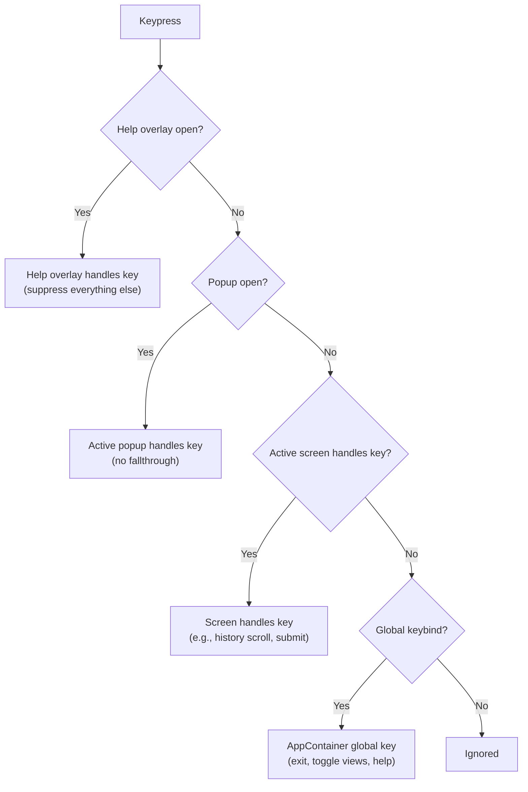

### Command palette (`/commands`)

Open the palette with `Ctrl+G` or type `/` in the Generate input.

Commands:

| Command                   | Args                     | What it does                                                                                        |
| ------------------------- | ------------------------ | --------------------------------------------------------------------------------------------------- |
| `/model`                  | -                        | Pick the generation model (popup)                                                                   |
| `/target`                 | -                        | Pick the target/runtime model (recorded; not included in prompt text) (popup)                       |
| `/polish`                 | `off\|clear\|--clear`    | Clear polish model, or pick the polish model (popup)                                                |
| `/intent`                 | `[path]`                 | Set an intent file path, or pick a file (popup)                                                     |
| `/meta` / `/instructions` | `[text]`                 | Set meta instructions, or open the meta editor (popup)                                              |
| `/new`                    | -                        | Reset session state                                                                                 |
| `/reuse`                  | -                        | Reset session and reuse last prompt                                                                 |
| `/file`                   | -                        | Add local file context (popup)                                                                      |
| `/url`                    | `[url ...]`              | Add one or more HTTP(S) URLs inline, or open the URL popup                                          |
| `/smart`                  | `on\|off`                | Toggle smart context                                                                                |
| `/smart-root`             | `<path>\|--clear\|clear` | Set/clear smart-context scan root (may auto-enable smart context)                                   |
| `/image`                  | `[path]`                 | Add an image path inline, or open the image popup                                                   |
| `/video`                  | `[path]`                 | Add a video path inline, or open the video popup                                                    |
| `/copy`                   | `[on\|off]`              | Toggle auto-copy, or open the toggle popup                                                          |
| `/chatgpt`                | `[on\|off]`              | Toggle auto-open-ChatGPT, or open the toggle popup                                                  |
| `/json`                   | `[on\|off]`              | Toggle showing the JSON payload in history (TUI-only; blocked when interactive transport is active) |
| `/tokens`                 | -                        | Show token breakdown (popup)                                                                        |
| `/settings`               | -                        | Show settings (popup)                                                                               |
| `/theme`                  | -                        | Theme picker (preview with arrows, `Enter` confirm, `Esc` cancel) (popup)                           |
| `/theme-mode`             | -                        | Theme mode picker (popup)                                                                           |
| `/reasoning` / `/why`     | -                        | Show last model reasoning (popup, when available)                                                   |
| `/history`                | -                        | Show command history (popup)                                                                        |
| `/series`                 | `[draft text]`           | Generate a set of standalone “atomic prompts”                                                       |
| `/test`                   | `[file]`                 | Run prompt tests (with a file arg) or open the test popup                                           |
| `/exit`                   | -                        | Exit the app                                                                                        |

Notes:

- `/theme-mode` opens a popup (it does not parse inline args).
- `/json` inside the TUI only toggles whether a JSON payload is shown in the history pane; it does not enable generate-mode `--json`.
- `/json` is blocked when `prompt-maker-cli ui --interactive-transport ...` is active.

### Series generation (“atomic prompts”)

`/series` (or `Tab`) generates:

- `00-overview.md`
- One file per atomic prompt step (e.g. `01-...md`, `02-...md`, ...)

Artifacts are written under:

- `generated/series/<timestamp>-<intent-slug>/`

If the output directory cannot be created (permissions, read-only filesystem, etc.), the series still generates but won’t be saved.

### D12. `/series` Generation and Filesystem Outputs

Shows the `/series` happy path and the best-effort write behavior.

<details>
<summary>Diagram</summary>

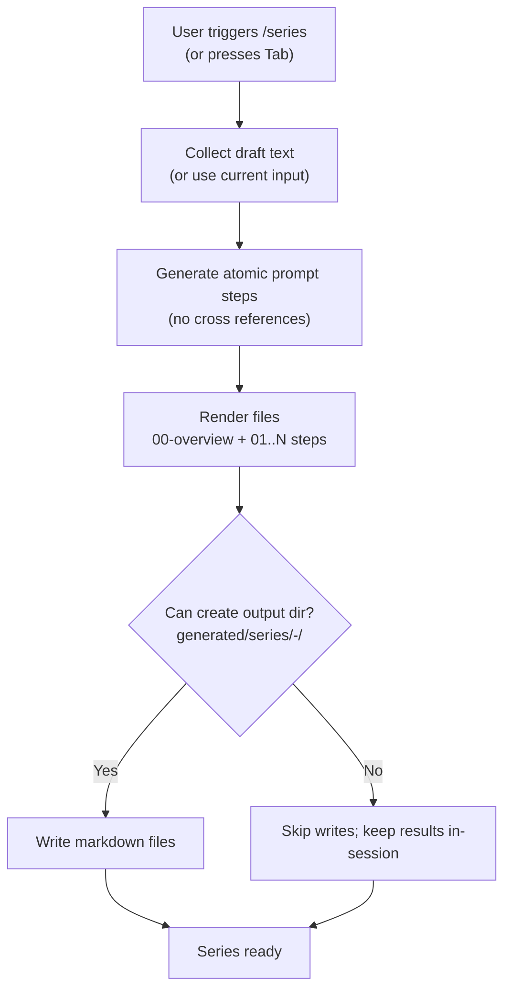

</details>

### TUI theming

Inside the TUI:

- `/theme` opens the theme picker.
- `/theme-mode` switches appearance mode (`dark`, `light`, or `system`).

Theme settings persist to CLI config (`theme` + `themeMode`).

Theme JSON format:

- Top-level `theme` object (required)
- Top-level `defs` object (optional)
- Canonical schema: `src/tui/theme/theme-types.ts`

#### Custom themes

Theme files are plain JSON. The theme name is the filename without `.json`.

- **Global** (per-user): `~/.config/prompt-maker-cli/themes/*.json`
- **Project-local**: `.prompt-maker-cli/themes/*.json`
  - Parent directories are also scanned (walking up from the current working directory).

Quick start:

```bash
# Global install
mkdir -p ~/.config/prompt-maker-cli/themes
cp src/tui/theme/examples/ocean-example.json ~/.config/prompt-maker-cli/themes/ocean.json

# Or project-local
mkdir -p .prompt-maker-cli/themes
cp src/tui/theme/examples/ocean-example.json .prompt-maker-cli/themes/ocean.json
```

Restart the TUI, then run `/theme` and select `ocean`.

#### Theme precedence

If multiple themes share the same name:

1. Project-local themes in the nearest directory to your CWD (highest precedence)
2. Project-local themes in ancestor directories
3. Global themes (`~/.config/prompt-maker-cli/themes`)
4. Built-in themes (lowest precedence)

### D13. Theme Resolution Precedence

Shows the lookup order used when multiple themes share a name.

<details>
<summary>Diagram</summary>


</details>

#### Theme mode (`system`)

`system` is intentionally pragmatic:

- If `TERM_BACKGROUND` is set to `light`/`dark`, it is used.
- Else, we try to infer from `COLORFGBG`.
- If no reliable signal is present, we deterministically fall back to `dark`.
- Config also accepts `themeMode: "auto"` as an alias for `"system"`.

---

## Generate mode (CLI)

Generate consumes intent from one of:

- Positional string: `prompt-maker-cli "..."`
- File: `--intent-file path/to/intent.md`
- `stdin`: pipe into the command

### Common workflows

```bash
# Inline intent + context files + copy to clipboard
prompt-maker-cli "Draft a confident onboarding-bot spec" \
  --model gpt-4o-mini \
  --context docs/spec/**/*.md \
  --image assets/wireframe.png \
  --copy

# URL context (web pages or GitHub)
prompt-maker-cli "Summarize the docs" \
  --url https://example.com/docs \
  --url https://github.com/example/repo/tree/main/docs

# Smart context (local embeddings) + scoped scan root
prompt-maker-cli "Explain this module" \
  --smart-context \
  --smart-context-root src

# JSON payload capture (non-interactive only)
prompt-maker-cli --intent-file drafts/travel.md --json > runs/travel.json

# Stream progress/events as JSONL (use --quiet to avoid mixing text output)
prompt-maker-cli "Summarize" --stream jsonl --quiet > runs/events.jsonl
```

### Key flags

| Flag / Input                                | Purpose                                                                               |
| ------------------------------------------- | ------------------------------------------------------------------------------------- |
| `<intent>` / `--intent-file <path>` / stdin | Provide the rough intent text. Pipe stdin when automating.                            |
| `-c, --context <glob>` (repeatable)         | Attach local file(s) to the request; globs use `fast-glob` (`dot: true`).             |
| `--url <https://...>` (repeatable)          | Download remote pages or GitHub content and attach as virtual context.                |
| `--smart-context`                           | Attach additional relevant local files via embeddings search.                         |
| `--smart-context-root <path>`               | Limit smart-context scanning to a specific directory (default: CWD).                  |
| `--image <path>` (repeatable)               | Attach reference images (PNG/JPG/JPEG/WEBP/GIF, ≤20MB).                               |
| `--video <path>` (repeatable)               | Attach reference videos (Gemini only; non-Gemini models are auto-switched).           |
| `--model <name>`                            | Override the generation model used by the CLI.                                        |
| `--target <name>`                           | Target/runtime model recorded in JSON/history (not included in prompt text).          |
| `-i, --interactive`                         | Enable a TTY refinement loop (requires a TTY).                                        |
| `--interactive-transport <path>`            | Listen on a Unix socket / Windows named pipe for `refine`/`finish` commands.          |
| `--polish`, `--polish-model <name>`         | Run the finishing pass and optionally choose a different model.                       |
| `--json`                                    | Emit machine-readable JSON (non-interactive only).                                    |
| `--stream none\|jsonl`                      | Emit newline-delimited JSON events to stdout.                                         |
| `--max-input-tokens <n>`                    | Cap total input tokens (intent + system + text context).                              |
| `--max-context-tokens <n>`                  | Cap tokens reserved for text context entries (file/url/smart).                        |
| `--context-overflow <strategy>`             | Overflow handling: `fail`, `drop-smart`, `drop-url`, `drop-largest`, `drop-oldest`.   |
| `--quiet`                                   | Suppress human-oriented output (banners/telemetry/boxed prompts).                     |
| `--progress/--no-progress`                  | Enable/disable progress spinners (spinners are disabled during interactive sessions). |
| `--show-context`                            | Print resolved context payload before generation.                                     |
| `--context-file <path>`                     | Write resolved context to disk (same format as `--show-context`).                     |
| `--context-format text\|json`               | Choose how `--show-context`/`--context-file` render the context payload.              |
| `--context-template <name>`                 | Wrap the final prompt using a named template (built-in: `nvim`).                      |
| `--copy`, `--open-chatgpt`                  | Copy/open the final artifact for quick sharing.                                       |

Notes:

- `--json` cannot be combined with interactive refinement (`--interactive` or `--interactive-transport`).
- `--show-context` prints to **stderr** when `--json` is enabled (so stdout stays machine-readable).
- `--stream jsonl` is designed for machine consumption; for clean JSONL output on stdout use `--quiet` and avoid other human-output flags.
- Token budgets apply only to **text** context entries (`--context`, `--url`, `--smart-context`); images/videos are not trimmed by these strategies.
- `DEBUG=1` or `VERBOSE=1` prints the model’s `reasoning` (if provided) to stderr.

### Conceptual architecture

Generate mode assembles a “prompt contract” from:

- **Intent** text
- **Resolved context** (local files, remote URLs/GitHub, optional smart context)
- **Optional media** parts (images, videos)
- **Model choices** (generation model and recorded target model)

Then it iterates (optionally interactively), optionally runs a polish pass, emits events, and writes history.

### D2. Generate Pipeline Overview

Summarizes the full “generate” path, including interactive refinement and the polish pass.

<details>
<summary>Diagram</summary>

```mermaid
flowchart TD
  A[Start: generate invocation] --> I["Intent intake<br>(positional | --intent-file | stdin)"]
  I --> V{Intent valid?<br>UTF-8, no NUL, <=512KB}
  V -- No --> FATAL["Fail fast<br>(intent required / invalid)"]
  V -- Yes --> C[Resolve context blocks]

  C --> CF[Local file context<br>--context globs]
  C --> CU["Remote URL context<br>--url http(s)"]
  C --> CG[GitHub URL expansion<br>--url github.com/...]
  C --> CS[Optional smart context<br>--smart-context]
  C --> CM[Optional media<br>--image / --video]

  CF --> DEDUPE[De-dupe / merge context paths]
  CU --> DEDUPE
  CG --> DEDUPE
  CS --> DEDUPE
  CM --> DEDUPE

  DEDUPE --> T["Token telemetry<br>(intent + context)"]
   T --> BUDGET{Token budgets enabled?\n--max-* or config}

   BUDGET -- No --> G1[Generation iteration 1<br>PromptGeneratorService.generatePrompt]
   BUDGET -- Yes --> TRIM{Context exceeds budget?}
   TRIM -- No --> G1
   TRIM -- Yes --> PRUNE[Trim text context per strategy\n(context.overflow)]
   PRUNE --> G1

  G1 --> INT{Interactive?<br>--interactive or --interactive-transport}
  INT -- No --> DONEITER[Stop refining]

  INT -- Yes --> LOOP["Interactive loop<br>(transport or TTY)"]
  LOOP --> GREF["Generation iteration N<br>(buildRefinementMessage)"]
  GREF --> LOOP
  LOOP --> DONEITER

  DONEITER --> P{Polish enabled?<br>--polish}
  P -- Yes --> POL["polishPrompt<br>(optional --polish-model)"]
  P -- No --> SKIP[Skip polish]

  POL --> OUT["Assemble output payload<br>(render template, history append)"]
  SKIP --> OUT

  OUT --> FINAL["Deliver artifacts<br>(prompt + renderedPrompt + JSON/history)"]
```

</details>

---

### Intent intake

Intent sources (exactly one must yield content):

- Inline argument
- `--intent-file <path>`
- stdin

Intent file constraints (used by integrations as guardrails):

- Must be UTF‑8 text
- Must not contain NUL bytes
- Size cap: 512 KB

### Context ingestion

Context can be attached from:

- Local file globs: `--context` (repeatable)
- Remote URLs: `--url` (repeatable)
- Smart context: `--smart-context` (+ `--smart-context-root`)
- Media: `--image`, `--video`

#### D6. Context Ingestion Decision Tree

Shows how sources are resolved, merged, and how errors are classified (warnings vs fatal).

<details>
<summary>Diagram</summary>

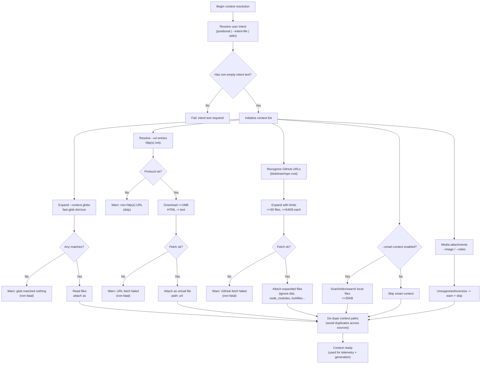

</details>

### Remote URL and GitHub context

- `--url` supports `http:`/`https:` only.
- Each URL becomes a virtual context file (`path: url:<url>`).
- HTML pages are capped at 1MB and converted to text (scripts/styles stripped).
- GitHub URLs are recognized for repo root, `tree`, and `blob` forms.
- GitHub safety limits:
  - ≤60 files
  - ≤64KB each
  - ignore lists (e.g., `node_modules`, `dist`, lockfiles, archives)
- Optional `GITHUB_TOKEN` improves rate limits.

#### D8. URL + GitHub Context Resolution

Summarizes remote context paths and the GitHub expansion safeguards.

<details>
<summary>Diagram</summary>

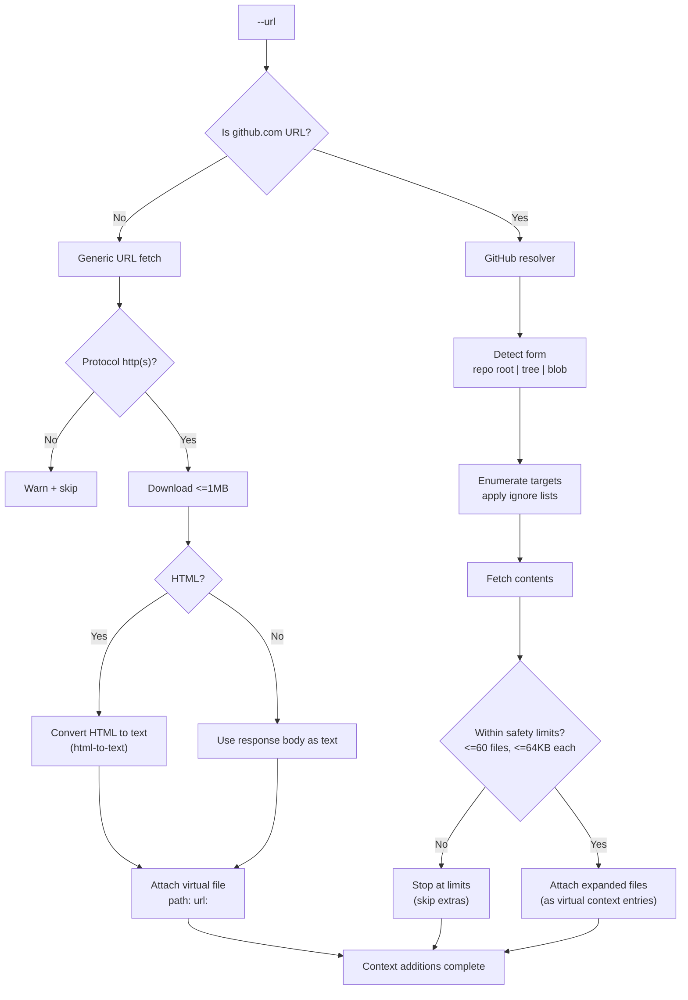

</details>

### Smart context (Local RAG)

Smart context attaches additional relevant local files based on embeddings.

- Trigger: `--smart-context` (optionally with `--smart-context-root <dir>`)
- Scan glob: `**/*.{ts,tsx,js,jsx,py,md,json}` (excludes `node_modules`, build outputs, lockfiles, git metadata)
- File cap: skip files larger than 25KB
- Cache: `~/.config/prompt-maker-cli/embeddings_cache.json`
- Select: top‑k results (default 5) against the intent string
- De-dupe: do not append files already attached via user context

#### D7. Smart Context Workflow

Shows the scan/index/search loop and where caching and de-dupe happen.

<details>
<summary>Diagram</summary>

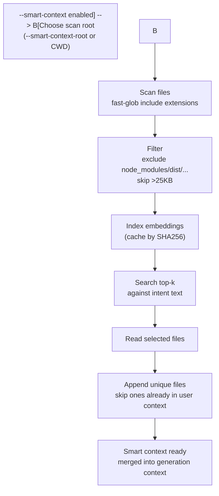

</details>

### Media attachments

- **Images** (`--image`): PNG/JPG/JPEG/WEBP/GIF up to 20 MB. Encoded into image parts.
- **Videos** (`--video`): Gemini-only.
  - If any `--video` is present and the requested model is not Gemini, the CLI auto-switches to a Gemini model (`gemini-3-pro-preview` or configured default).
  - Uploads use Google’s Files API and poll until the file becomes `ACTIVE`.
  - Upload progress emits stream events.

#### D9. Media Handling (Images + Videos)

Shows validation, model switching for videos, and upload attachment.

<details>
<summary>Diagram</summary>

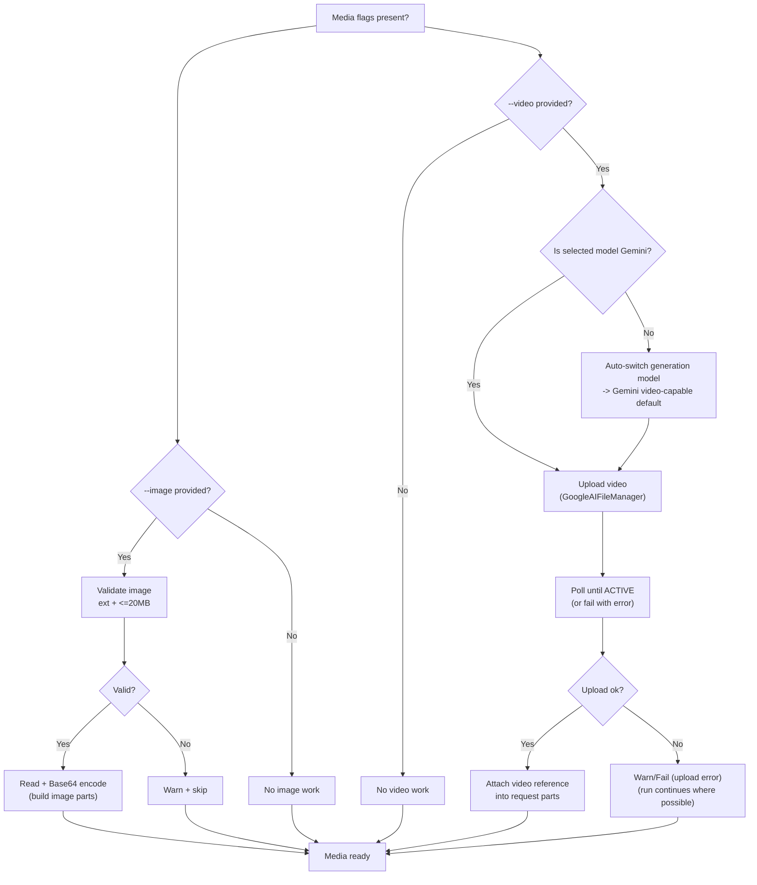

</details>

### Streaming events and telemetry

`--stream none|jsonl` controls whether events are printed to stdout.

- `--stream jsonl` emits newline-delimited JSON events to stdout.
- Even with `--stream none`, the interactive transport acts as an always-on “tap” that receives the same events.

Event types (integration-relevant highlights):

- `context.telemetry` (intent/system/context/total token counts)
- `context.overflow` (emitted when budgets force text-context trimming)
- `progress.update` (machine-readable progress)
- `upload.state` (image/video upload start/finish)
- `generation.iteration.start` / `generation.iteration.complete`
- `interactive.state` / `interactive.awaiting`
- `transport.listening`, `transport.client.connected`, `transport.client.disconnected`
- `generation.final` (final JSON payload)

#### D3. `--stream jsonl` Event Timeline

Shows a typical event sequence (actual events depend on flags and context sources).

<details>
<summary>Diagram</summary>

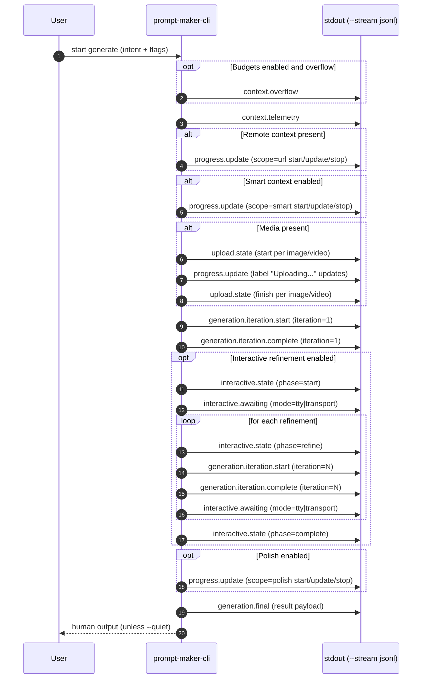

</details>

### Interactive refinement

Two interactive mechanisms exist:

- `--interactive` (TTY): uses terminal prompts to ask whether to refine and to collect the next refinement instruction.
  - If `--interactive` is set but no TTY is detected, the CLI warns and proceeds non-interactively.
- `--interactive-transport <path>`: accepts newline-delimited JSON commands over a local socket/pipe.
  - Unix: pass a socket path like `/tmp/pmc.sock`.
  - Windows: pass a named pipe path like `\\.\pipe\pmc`.

Commands are newline-delimited JSON:

```json
{"type":"refine","instruction":"Make it shorter"}
{"type":"finish"}
```

The transport also receives the same JSONL stream events as an always-on event “tap” (even if `--stream` is `none`).

#### D4. `--interactive-transport` Lifecycle

Shows how a client drives refinement and how events mirror back over the same connection.

<details>
<summary>Diagram</summary>

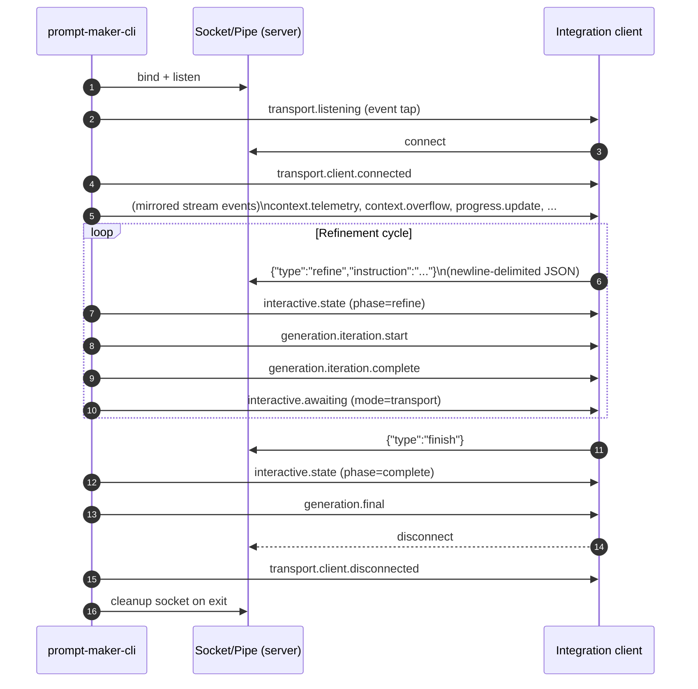

</details>

#### D5. Interactive Phase State Machine

Shows the high-level phases exposed via events during refinement.

<details>
<summary>Diagram</summary>

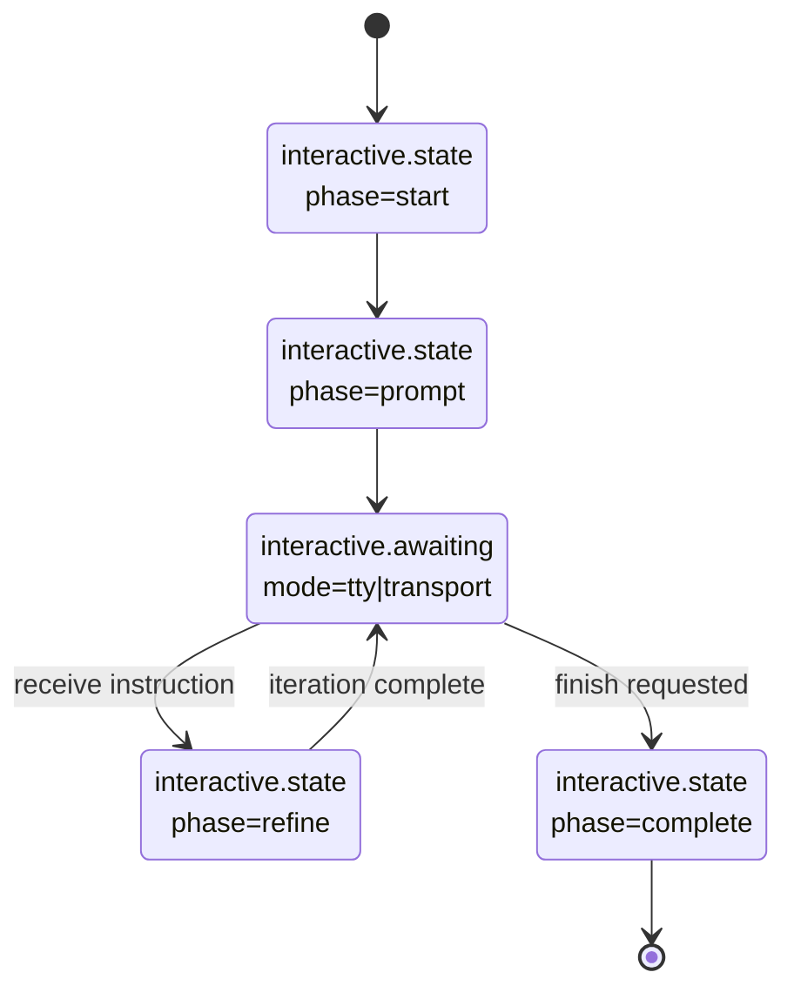

</details>

### Polish pass

`--polish` triggers a finishing pass (`polishPrompt`) that focuses on formatting fidelity.

- Polish model defaults to the generation model.
- Override with `--polish-model` (or `PROMPT_MAKER_POLISH_MODEL`).

### Output artifacts

A completed run can produce:

- `prompt`: the final generated prompt text (untemplated)
- `polishedPrompt`: present when `--polish` is used
- `renderedPrompt`: present when `--context-template <name>` is applied
- `generation.final` stream event: includes the full payload (`GenerateJsonPayload`)
- History append: `~/.config/prompt-maker-cli/history.jsonl`

Practical integration rule (used by editor integrations):

- Prefer `renderedPrompt` if present.
- Else prefer `polishedPrompt` if present.
- Else use `prompt`.

<details>
<summary>Reference: output payload fields (GenerateJsonPayload)</summary>

From `docs/neovim-plugin-integration.md`, the JSON payload includes (high-level):

- `intent`
- `model` (generation model)
- `targetModel` (recorded runtime model)
- `prompt`
- `refinements`, `iterations`, `interactive`
- `timestamp`
- `contextPaths`
- optional `outputPath`
- optional `polishedPrompt`, `polishModel`
- optional `contextTemplate`, `renderedPrompt`

</details>

---

## Prompt tests

```bash
prompt-maker-cli test
# or
prompt-maker-cli test prompt-tests.yaml
```

- Default file: `prompt-tests.yaml` (repo root)
- TUI Test Runner view: `Ctrl+T`
- Quirk: `prompt-maker-cli test --help` prints help but still runs the suite

### D14. Prompt Test Runner Flow

Shows CLI and TUI entry points converging on the same runner.

<details>
<summary>Diagram</summary>

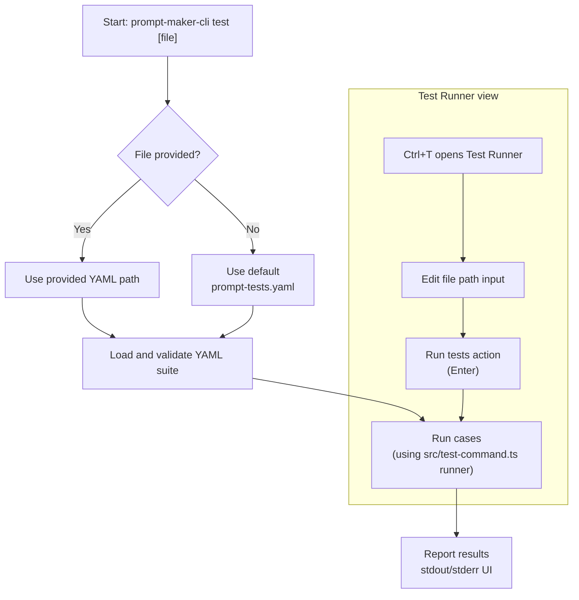

</details>

---

## TUI architecture and UX model

The TUI is organized around an `AppContainer` that selects the active screen and enforces input routing invariants.

- Screens:
  - Generate screen: `src/tui/screens/command/CommandScreen.tsx`
  - Test Runner screen: `src/tui/screens/test-runner/TestRunnerScreen.tsx`
- Popups:
  - Popup transitions managed by `src/tui/popup-reducer.ts` (pure reducer)
  - Side effects and orchestration managed by `src/tui/hooks/usePopupManager.ts`
- Keybinds:
  - Defined by `src/tui/app-container-keymap.ts`

Reference: `docs/tui-design.md`.

### D10. TUI Architecture Map

Shows how routing, screens, and popups fit together conceptually.

<details>
<summary>Diagram</summary>

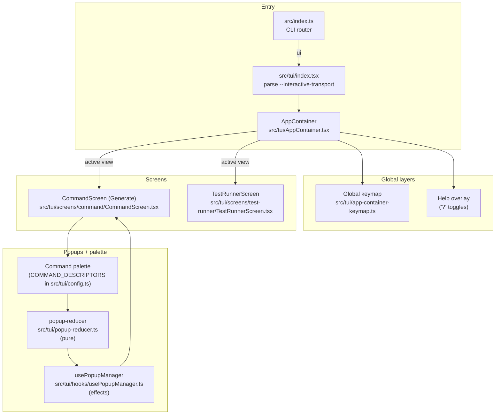

</details>

---

## Provider configuration

Credentials and defaults can come from env vars or a config file.

Config path resolution:

- `PROMPT_MAKER_CLI_CONFIG=/path/to/config.json` (highest precedence)
- `~/.config/prompt-maker-cli/config.json`
- `~/.prompt-maker-cli.json`

Example config:

```json
{
  "openaiApiKey": "sk-...",
  "geminiApiKey": "gk-...",
  "promptGenerator": {
    "defaultModel": "gpt-4o-mini",
    "defaultGeminiModel": "gemini-2.5-pro"
  },
  "contextTemplates": {
    "scratch": "# Scratch\n\n{{prompt}}"
  },
  "theme": "ocean",
  "themeMode": "system"
}
```

Env vars override config keys:

- `OPENAI_API_KEY` (and optional `OPENAI_BASE_URL`)
- `GEMINI_API_KEY` (and optional `GEMINI_BASE_URL`)
- Optional: `GITHUB_TOKEN` (for GitHub URL context rate limits)

---

## Outputs and persistence

- Generate-run history (JSONL): `~/.config/prompt-maker-cli/history.jsonl`
- TUI command history: `~/.config/prompt-maker-cli/tui-history.json`
- Token telemetry:
  - Printed as a summary in non-`--quiet` runs
  - Always emitted as a `context.telemetry` JSONL stream event
  - When budgets force trimming, a `context.overflow` event is also emitted

---

## Development

```bash
npm ci
npm run build
npm start

# watch + restart
npm run dev -- ui
npm run dev -- "Draft a confident onboarding-bot spec" --model gemini-1.5-flash

npm run typecheck
npm test
npm run format
```

---

## Maintainer references

- `docs/prompt-maker-cli-tui-encyclopedia.md` (authoritative behavior reference)
- `docs/tui-design.md` (UX goals + input routing invariant)
- `docs/neovim-plugin-integration.md` (generate pipeline + streaming events + interactive transports)
- `src/tui/DEVELOPER_NOTE.md` (architecture notes; some paths are historical)

---

## License

MIT
