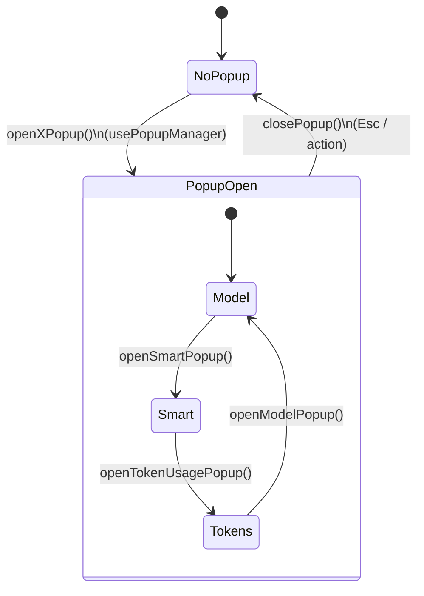
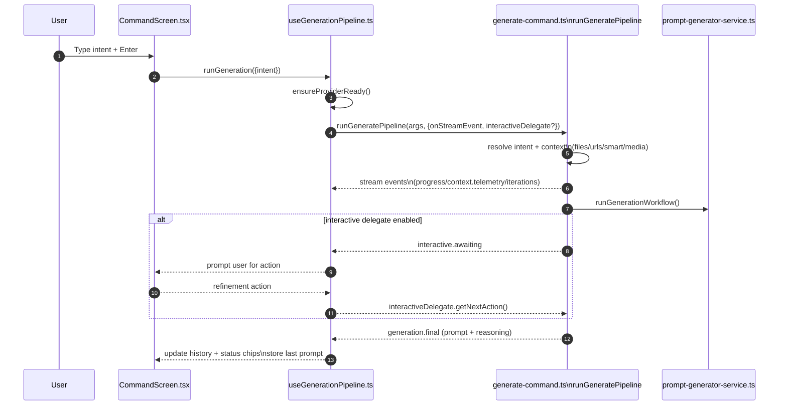

# Encyclopedic Technical Explanation of `prompt-maker-cli` TUI (Architecture, Data Flow, and Key Modules)

This document explains how the **`prompt-maker-cli`** Text UI (TUI) works: architecture, data flow, state management, keyboard handling, command/popup system, context ingestion, generation pipeline integration, and extension points. All behavioral claims are grounded in the codebase and cite file paths with line anchors.

---

## Table of Contents

1. [High-Level Architecture](#high-level-architecture)
2. [Entrypoints & Routing (CLI → TUI vs Generate vs Test)](#entrypoints--routing-cli--tui-vs-generate-vs-test)
3. [Top-Level UI Composition (`AppContainer`)](#top-level-ui-composition-appcontainer)
4. [UI Composition Deep Dive (`CommandScreen`)](#ui-composition-deep-dive-commandscreen)
5. [Keyboard Handling](#keyboard-handling)
6. [Command System (Detection, Matching, Execution)](#command-system-detection-matching-execution)
7. [Popup System](#popup-system)
8. [Generation Pipeline Integration](#generation-pipeline-integration)
9. [Interactive Refinement: TUI Delegate vs Interactive Transport](#interactive-refinement-tui-delegate-vs-interactive-transport)
10. [Series Generation Flow & Artifact Writing](#series-generation-flow--artifact-writing)
11. [Test Runner Flow (CLI and TUI)](#test-runner-flow-cli-and-tui)
12. [State Management & Persistence](#state-management--persistence)
13. [Context Ingestion (Files, URLs, GitHub, Smart Context, Media)](#context-ingestion-files-urls-github-smart-context-media)
14. [Model Selection & Provider Readiness](#model-selection--provider-readiness)
15. [Streaming, Telemetry, and Token Usage](#streaming-telemetry-and-token-usage)
16. [Extensibility Guide](#extensibility-guide)
17. [Testing Strategy](#testing-strategy)
18. [Glossary (Key Terms & Types)](#glossary-key-terms--types)

---

## High-Level Architecture

At a high level, the project has **three execution modes**:

- `generate` (default): runs the generation pipeline and prints results.
- `test`: runs prompt tests.
- `ui` (default when no args): runs the Ink-based TUI.

This routing is implemented in `apps/prompt-maker-cli/src/index.ts:6`–`apps/prompt-maker-cli/src/index.ts:54`.

### Major module boundaries

- **CLI routing and pipeline**
  - Command dispatch: `apps/prompt-maker-cli/src/index.ts:8`
  - Generate pipeline: `apps/prompt-maker-cli/src/generate-command.ts:52`
  - Prompt generation + series generation: `apps/prompt-maker-cli/src/prompt-generator-service.ts:101`

- **TUI shell and screens**
  - TUI render entry: `apps/prompt-maker-cli/src/tui/index.tsx:31`
  - App container + view switching: `apps/prompt-maker-cli/src/tui/AppContainer.tsx:17`
  - Main interactive screen: `apps/prompt-maker-cli/src/tui/CommandScreen.tsx:124`
  - Test runner screen: `apps/prompt-maker-cli/src/tui/TestRunnerScreen.tsx:60`

- **TUI hooks and state machines**
  - Pipeline adapter (TUI → CLI pipeline): `apps/prompt-maker-cli/src/tui/hooks/useGenerationPipeline.ts:149`
  - Popup state machine: `apps/prompt-maker-cli/src/tui/hooks/usePopupManager.ts:70`
  - Context store (files/urls/etc): `apps/prompt-maker-cli/src/tui/context-store.ts:3`

- **Context ingestion**
  - File globs: `apps/prompt-maker-cli/src/file-context.ts:9`
  - URL fetching: `apps/prompt-maker-cli/src/url-context.ts:13`
  - GitHub fetching rules: `apps/prompt-maker-cli/src/github-context.ts:53`
  - Smart context (embeddings + search): `apps/prompt-maker-cli/src/smart-context-service.ts:26`

---

## Architecture diagram (modules + responsibilities)

```mermaid
flowchart LR
  subgraph CLI[CLI entrypoint]
    idx[src/index.ts\nresolveCommand + dispatch]
  end

  idx -->|ui| tui[src/tui/index.tsx\nInk render()]
  idx -->|generate / expand| gen[src/generate-command.ts\nrunGeneratePipeline()]
  idx -->|test| test[src/test-command.ts\nrunTestCommand()]

  subgraph TUI[TUI (Ink)]
    tui --> app[AppContainer.tsx\nContextProvider + view switch + global keys]
    app --> cmd[CommandScreen.tsx\nhistory + overlays + input]
    app --> tr[TestRunnerScreen.tsx\nTUI runner]

    cmd --> pop[usePopupManager.ts\npopup state machine]
    cmd --> pipe[useGenerationPipeline.ts\nTUI adapter around pipeline]
  end

  subgraph Core[Core services]
    gen --> ctx[file-context.ts / url-context.ts / github-context.ts]
    gen --> smart[smart-context-service.ts\n+ rag/vector-store.ts]
    gen --> prov[model-providers.ts]
    gen --> pgs[prompt-generator-service.ts\n(workflow + series)]
  end

  pipe --> gen
  pipe --> prov
  pipe --> ctx
  pipe --> smart
  test --> gen
```

(Mermaid version of the ASCII diagram below.)

```
+------------------------------- prompt-maker-cli -------------------------------+
|                                                                               |
|  CLI entrypoint                                                               |
|  `src/index.ts` routes -> ui | generate | test                                |
|          |                                                               |
|          +--------------------+---------------------+---------------------+
|                               |                     |
|                           TUI (Ink)              Generate pipeline        Test pipeline
|                        `src/tui/index.tsx`        `src/generate-command.ts` `src/test-command.ts`
|                               |                     |
|                        `AppContainer`              `runGeneratePipeline()`   `runPromptTestSuite()`
|                        (view switch, help)         (context, gen, polish)    (YAML -> gen -> judge)
|                               |
|                   +-----------+-------------+
|                   |                         |
|             `CommandScreen`            `TestRunnerScreen`
|             (history/input/            (TUI test runner)
|              command palette)
|                   |
|          +--------+---------+
|          |                  |
|  `usePopupManager`   `useGenerationPipeline`
|   (popup state)        (TUI adapter around runGeneratePipeline,
|                         plus series + token usage + stream mapping)
|          |                  |
|    popup components     context ingestion / providers / telemetry
|   `tui/components/...`  `file-context.ts`, `url-context.ts`, `smart-context...`
|                                                                               |
+-------------------------------------------------------------------------------+
```

---

## Entrypoints & Routing (CLI → TUI vs Generate vs Test)

### `src/index.ts` routing rules

`apps/prompt-maker-cli/src/index.ts:27`–`apps/prompt-maker-cli/src/index.ts:54` decides the CLI command:

- No args → defaults to `ui` (`resolveCommand` returns `{ command: 'ui' }`), see `apps/prompt-maker-cli/src/index.ts:28`–`apps/prompt-maker-cli/src/index.ts:35`.
- First token is `test` → `runTestCommand(rest)`, see `apps/prompt-maker-cli/src/index.ts:11`–`apps/prompt-maker-cli/src/index.ts:13`.
- First token is `ui` → `loadAndRunTui(rest)`, see `apps/prompt-maker-cli/src/index.ts:14`–`apps/prompt-maker-cli/src/index.ts:16`.
- `generate` or `expand` is treated as generate, see `apps/prompt-maker-cli/src/index.ts:45`–`apps/prompt-maker-cli/src/index.ts:47`.
- Flags (`-...`) or any other token → also treated as generate, see `apps/prompt-maker-cli/src/index.ts:49`–`apps/prompt-maker-cli/src/index.ts:54`.

### TUI entry: `src/tui/index.tsx`

The TUI is rendered via Ink’s `render()` in `apps/prompt-maker-cli/src/tui/index.tsx:31`–`apps/prompt-maker-cli/src/tui/index.tsx:37`.

- The only TUI-specific CLI arg parsed here is `--interactive-transport` (either `--interactive-transport path` or `--interactive-transport=path`), see `apps/prompt-maker-cli/src/tui/index.tsx:9`–`apps/prompt-maker-cli/src/tui/index.tsx:27`.
- That option is passed into `<AppContainer interactiveTransport={...} />`, see `apps/prompt-maker-cli/src/tui/index.tsx:33`–`apps/prompt-maker-cli/src/tui/index.tsx:35`.

---

## Top-Level UI Composition (`AppContainer`)

`AppContainer` is the top-level layout component and global keyboard router for the TUI: `apps/prompt-maker-cli/src/tui/AppContainer.tsx:17`.

### Responsibilities

1. **Wraps the application in the shared context provider**
   - `<ContextProvider>` wraps everything, see `apps/prompt-maker-cli/src/tui/AppContainer.tsx:22`–`apps/prompt-maker-cli/src/tui/AppContainer.tsx:65`.
   - Context shape is defined in `apps/prompt-maker-cli/src/tui/context-store.ts:3`–`apps/prompt-maker-cli/src/tui/context-store.ts:29`.

2. **View switching (“generate” vs “tests”)**
   - Local state `view` controls which screen is rendered, see `apps/prompt-maker-cli/src/tui/AppContainer.tsx:20` and `apps/prompt-maker-cli/src/tui/AppContainer.tsx:129`–`apps/prompt-maker-cli/src/tui/AppContainer.tsx:56`.

3. **Help overlay layout reservation**
   - Help content is created and height-estimated with `createHelpSections` and `estimateHelpOverlayHeight`, see `apps/prompt-maker-cli/src/tui/AppContainer.tsx:113`–`apps/prompt-maker-cli/src/tui/AppContainer.tsx:120`.
   - When help is open, `helpReservedRows` is passed down to `CommandScreen` as `reservedRows`, see `apps/prompt-maker-cli/src/tui/AppContainer.tsx:119` and `apps/prompt-maker-cli/src/tui/AppContainer.tsx:141`–`apps/prompt-maker-cli/src/tui/AppContainer.tsx:48`.
   - Help overlay component: `apps/prompt-maker-cli/src/tui/components/core/HelpOverlay.tsx:12`.

4. **Hide terminal cursor**
   - Uses `cliCursor.hide()` in a `useEffect` for TTY sessions, see `apps/prompt-maker-cli/src/tui/AppContainer.tsx:28`–`apps/prompt-maker-cli/src/tui/AppContainer.tsx:37`.

5. **Global keyboard shortcuts**
   - Delegates to `resolveAppContainerKeyAction`, see `apps/prompt-maker-cli/src/tui/AppContainer.tsx:57`–`apps/prompt-maker-cli/src/tui/AppContainer.tsx:108`.
   - Key mapping rules are in `apps/prompt-maker-cli/src/tui/app-container-keymap.ts:51`.

### Help overlay behavior

- Help is toggled by `?` (non-ctrl/non-meta), see `apps/prompt-maker-cli/src/tui/app-container-keymap.ts:36`–`apps/prompt-maker-cli/src/tui/app-container-keymap.ts:41` and `apps/prompt-maker-cli/src/tui/app-container-keymap.ts:65`–`apps/prompt-maker-cli/src/tui/app-container-keymap.ts:67`.
- While help is open, _global routing consumes everything except Esc or ?_ (closing help), see `apps/prompt-maker-cli/src/tui/app-container-keymap.ts:58`–`apps/prompt-maker-cli/src/tui/app-container-keymap.ts:63`.

---

## UI Composition Deep Dive (`CommandScreen`)

`CommandScreen` is the main generation UI: history viewport + overlays + input bar, with complex keyboard layering. The file is large but the key structural render is at `apps/prompt-maker-cli/src/tui/CommandScreen.tsx:1852`–`apps/prompt-maker-cli/src/tui/CommandScreen.tsx:1998`.

### Layout structure (vertical stack)

1. **History viewport**
   - Renders `ScrollableOutput`, see `apps/prompt-maker-cli/src/tui/CommandScreen.tsx:1861`–`apps/prompt-maker-cli/src/tui/CommandScreen.tsx:1866`.
   - `ScrollableOutput` colors by entry kind (`user`, `progress`, `system`), see `apps/prompt-maker-cli/src/tui/components/core/ScrollableOutput.tsx:21`–`apps/prompt-maker-cli/src/tui/components/core/ScrollableOutput.tsx:44`.

2. **Overlay zone (mutually exclusive with help)**
   - If a popup is open and help is not open, it renders the popup container, see `apps/prompt-maker-cli/src/tui/CommandScreen.tsx:1867`–`apps/prompt-maker-cli/src/tui/CommandScreen.tsx:1966`.
   - If command menu is active, renders `CommandMenu`, see `apps/prompt-maker-cli/src/tui/CommandScreen.tsx:1968`–`apps/prompt-maker-cli/src/tui/CommandScreen.tsx:1972`.

3. **Paste-preview card (only when not help/popup)**
   - Shows `PastedSnippetCard`, see `apps/prompt-maker-cli/src/tui/CommandScreen.tsx:1974`–`apps/prompt-maker-cli/src/tui/CommandScreen.tsx:1978`.
   - Card component: `apps/prompt-maker-cli/src/tui/components/core/PastedSnippetCard.tsx:10`.

4. **Input bar**
   - `InputBar` is always rendered at the bottom, see `apps/prompt-maker-cli/src/tui/CommandScreen.tsx:1980`.
   - It embeds `MultilineTextInput` which implements editing, cursor, Enter submit, and Ctrl+J / Alt+Enter newline rules, see `apps/prompt-maker-cli/src/tui/components/core/MultilineTextInput.tsx:81`–`apps/prompt-maker-cli/src/tui/components/core/MultilineTextInput.tsx:105`.

### Overlay precedence (Help > Popup > Command Menu)

```mermaid
flowchart TD
  K[Keypress arrives] --> H{Help open?}
  H -->|yes| HC[AppContainer handles\nEsc/? closes help]
  H -->|no| P{Popup open?}
  P -->|yes| PC[Popup handler\n(navigation, close)]
  P -->|no| C{Command menu active?}
  C -->|yes| CM[CommandMenu handler\n(up/down/select)]
  C -->|no| S{Scrolling keys?}
  S -->|yes| SC[ScrollableOutput scroll]
  S -->|no| T[MultilineTextInput edits/submit]
```

Overlay height and history area calculations explicitly prioritize help above everything:

- `overlayHeight` is forced to 0 when help is open, see `apps/prompt-maker-cli/src/tui/CommandScreen.tsx:531`–`apps/prompt-maker-cli/src/tui/CommandScreen.tsx:536`.
- Popups are rendered only when `popupState && !helpOpen`, see `apps/prompt-maker-cli/src/tui/CommandScreen.tsx:1867`.
- Command menu renders only when `isCommandMenuActive`, which is false when help or popups are active (`isCommandMenuActive = isCommandMode && !isPopupOpen && !helpOpen`), see `apps/prompt-maker-cli/src/tui/CommandScreen.tsx:526`–`apps/prompt-maker-cli/src/tui/CommandScreen.tsx:528`.

### Terminal integration details

- Clears terminal and enables bracketed paste mode on mount, see `apps/prompt-maker-cli/src/tui/CommandScreen.tsx:738`–`apps/prompt-maker-cli/src/tui/CommandScreen.tsx:747`.
  - Clear screen: `stdout.write('\x1bc')`
  - Enable bracketed paste: `stdout.write('\x1b[?2004h')`

---

## Keyboard Handling

Keyboard input is handled at multiple layers:

1. `AppContainer` global shortcuts (always active)
2. `CommandScreen` non-text key handlers (scrolling, Tab actions, popup navigation, command menu nav)
3. `MultilineTextInput` (text editing and submission)

### Global keymap (`AppContainer`)

Defined by `resolveAppContainerKeyAction` in `apps/prompt-maker-cli/src/tui/app-container-keymap.ts:51`:

- `Ctrl+C` → exit (`type: 'exit'`), see `apps/prompt-maker-cli/src/tui/app-container-keymap.ts:69`–`apps/prompt-maker-cli/src/tui/app-container-keymap.ts:71`.
- `Esc` → exit **except** when generate view has a popup open, see `apps/prompt-maker-cli/src/tui/app-container-keymap.ts:73`–`apps/prompt-maker-cli/src/tui/app-container-keymap.ts:78`.
- `Ctrl+G` → open command palette (or switch to generate + open it), see `apps/prompt-maker-cli/src/tui/app-container-keymap.ts:86`–`apps/prompt-maker-cli/src/tui/app-container-keymap.ts:90`.
- `Ctrl+T` → switch to test runner view, see `apps/prompt-maker-cli/src/tui/app-container-keymap.ts:92`–`apps/prompt-maker-cli/src/tui/app-container-keymap.ts:94`.
- `?` toggles help, see `apps/prompt-maker-cli/src/tui/app-container-keymap.ts:65`–`apps/prompt-maker-cli/src/tui/app-container-keymap.ts:67`.

**Edge case:** When help opens, `AppContainer` calls `suppressNextInput()` on the active screen so the triggering character (like `?`) doesn’t get inserted into the input buffer, see `apps/prompt-maker-cli/src/tui/AppContainer.tsx:70`–`apps/prompt-maker-cli/src/tui/AppContainer.tsx:80`.

### `CommandScreen` key handling layers

Key handlers in `CommandScreen` are gated using Ink’s `useInput(..., { isActive })` to enforce precedence:

- **Bracketed paste ingestion** runs only when no popup/help, see `apps/prompt-maker-cli/src/tui/CommandScreen.tsx:793`–`apps/prompt-maker-cli/src/tui/CommandScreen.tsx:824`.
- **History scrolling** (↑/↓, PgUp/PgDn) runs only when not command menu, not popup, not help, see `apps/prompt-maker-cli/src/tui/CommandScreen.tsx:826`–`apps/prompt-maker-cli/src/tui/CommandScreen.tsx:845`.
- **Command menu navigation** uses ↑/↓ and Esc to clear input, see `apps/prompt-maker-cli/src/tui/CommandScreen.tsx:847`–`apps/prompt-maker-cli/src/tui/CommandScreen.tsx:867`.
- **Tab behavior (two meanings):**
  - If input is a dropped absolute file path and no command mode/menu/popup, Tab adds file to context, see `apps/prompt-maker-cli/src/tui/CommandScreen.tsx:885`–`apps/prompt-maker-cli/src/tui/CommandScreen.tsx:898`.
  - Otherwise Tab opens series popup (`/series`), logs it to command history, and routes to command handler, see `apps/prompt-maker-cli/src/tui/CommandScreen.tsx:899`–`apps/prompt-maker-cli/src/tui/CommandScreen.tsx:906`.

- **Popup key handling** is centralized in one handler that switches on `popupState.type`, see `apps/prompt-maker-cli/src/tui/CommandScreen.tsx:1127`–`apps/prompt-maker-cli/src/tui/CommandScreen.tsx:1490`.

### Text editing and multiline rules (`MultilineTextInput`)

`apps/prompt-maker-cli/src/tui/components/core/MultilineTextInput.tsx:81` defines:

- `Enter` submits current input (`onSubmit(value)`), see `apps/prompt-maker-cli/src/tui/components/core/MultilineTextInput.tsx:101`–`apps/prompt-maker-cli/src/tui/components/core/MultilineTextInput.tsx:105`.
- Newline insert is supported via:
  - `Ctrl+J` (`key.ctrl && input === 'j'`)
  - `Alt+Enter` / escape sequences
  - see `apps/prompt-maker-cli/src/tui/components/core/MultilineTextInput.tsx:91`–`apps/prompt-maker-cli/src/tui/components/core/MultilineTextInput.tsx:99`.

---

## Command System (Detection, Matching, Execution)

### Command detection: `/command` vs absolute paths

Command-vs-path detection lives in `apps/prompt-maker-cli/src/tui/drag-drop-path.ts`.

- `isCommandInput()` returns `true` if input starts with `/`, **unless** the input looks like a valid absolute file path (POSIX or Windows) and should be treated as a path, see `apps/prompt-maker-cli/src/tui/drag-drop-path.ts:33`–`apps/prompt-maker-cli/src/tui/drag-drop-path.ts:58`.
- Important nuance:
  - A POSIX absolute path like `/Users/.../file.ts` has nested segments, so it is _not_ treated as a command input (`hasNestedSegment` → `false` return), see `apps/prompt-maker-cli/src/tui/drag-drop-path.ts:51`–`apps/prompt-maker-cli/src/tui/drag-drop-path.ts:55`.
  - A single-segment absolute path like `/tmp` is treated as a command **only if it does not exist**, see `apps/prompt-maker-cli/src/tui/drag-drop-path.ts:57`–`apps/prompt-maker-cli/src/tui/drag-drop-path.ts:58`.

This is how the TUI supports both:

- `/model` style commands
- drag-dropped absolute file paths (which begin with `/` on macOS/Linux)

### Command descriptors and matching

All commands shown in the command palette come from `COMMAND_DESCRIPTORS` in `apps/prompt-maker-cli/src/tui/config.ts:1`–`apps/prompt-maker-cli/src/tui/config.ts:43`.

Matching behavior (prefix-based) is computed in `commandMatches`, see `apps/prompt-maker-cli/src/tui/CommandScreen.tsx:504`–`apps/prompt-maker-cli/src/tui/CommandScreen.tsx:524`:

- A command matches if:
  - `command.id.startsWith(query)`
  - or `command.label.startsWith(query)`
  - or any `aliases` startsWith(query)

### Command menu activation

- `isCommandMenuActive = isCommandMode && !isPopupOpen && !helpOpen`, see `apps/prompt-maker-cli/src/tui/CommandScreen.tsx:526`–`apps/prompt-maker-cli/src/tui/CommandScreen.tsx:528`.

### Command execution

When Enter is pressed, `handleSubmit` determines what to do, in priority order, see `apps/prompt-maker-cli/src/tui/CommandScreen.tsx:1560`–`apps/prompt-maker-cli/src/tui/CommandScreen.tsx:1662`:

1. If awaiting refinement (interactive delegate flow), submission is routed to `submitRefinement`, see `apps/prompt-maker-cli/src/tui/CommandScreen.tsx:1562`–`apps/prompt-maker-cli/src/tui/CommandScreen.tsx:1566`.
2. If awaiting `/new` reuse confirmation, it consumes y/n, see `apps/prompt-maker-cli/src/tui/CommandScreen.tsx:1568`–`apps/prompt-maker-cli/src/tui/CommandScreen.tsx:1594`.
3. If a popup is open: submission is ignored here (popups handle Enter themselves), see `apps/prompt-maker-cli/src/tui/CommandScreen.tsx:1596`–`apps/prompt-maker-cli/src/tui/CommandScreen.tsx:1599`.
4. If command menu active: runs selected command via `handleCommandSelection`, see `apps/prompt-maker-cli/src/tui/CommandScreen.tsx:1600`–`apps/prompt-maker-cli/src/tui/CommandScreen.tsx:1614`.
5. If command mode but not command menu (edge cases): clears input, see `apps/prompt-maker-cli/src/tui/CommandScreen.tsx:1616`–`apps/prompt-maker-cli/src/tui/CommandScreen.tsx:1619`.
6. Otherwise: treat as an intent and start generation (typed or intent-file-based), see `apps/prompt-maker-cli/src/tui/CommandScreen.tsx:1621`–`apps/prompt-maker-cli/src/tui/CommandScreen.tsx:1646`.

---

## Popup System



The popup system is an explicit state machine stored in `popupState` and managed by `usePopupManager`.

- Popup state union type: `apps/prompt-maker-cli/src/tui/types.ts:27`–`apps/prompt-maker-cli/src/tui/types.ts:47`.
- Central manager/hook: `apps/prompt-maker-cli/src/tui/hooks/usePopupManager.ts:70`.

### Popup manager responsibilities

`usePopupManager` is responsible for:

- Opening/closing popups
- Handling `/command` selection semantics
- Applying changes to global context or local toggles
- Enforcing constraints like “JSON cannot be enabled when interactive transport is enabled”

Key constraint:

- `JSON_INTERACTIVE_ERROR = 'JSON output is unavailable while interactive transport is enabled.'`, see `apps/prompt-maker-cli/src/tui/hooks/usePopupManager.ts:68`.
- Enforced both in toggle logic and command handling, see:
  - `apps/prompt-maker-cli/src/tui/hooks/usePopupManager.ts:232`–`apps/prompt-maker-cli/src/tui/hooks/usePopupManager.ts:239`
  - `apps/prompt-maker-cli/src/tui/hooks/usePopupManager.ts:355`–`apps/prompt-maker-cli/src/tui/hooks/usePopupManager.ts:361`

### How `/series` popup is prefilled (important flow)

When `/series` is selected, it:

1. Refuses to start if generation is already running, see `apps/prompt-maker-cli/src/tui/hooks/usePopupManager.ts:414`–`apps/prompt-maker-cli/src/tui/hooks/usePopupManager.ts:417`.
2. Prefers intent sources in order:
   - `/series <args>` (explicit)
   - latest typed input (tracked by `getLatestTypedIntent`)
   - last run intent (`lastUserIntentRef.current`)
   - intent file content (read if configured)
     see `apps/prompt-maker-cli/src/tui/hooks/usePopupManager.ts:419`–`apps/prompt-maker-cli/src/tui/hooks/usePopupManager.ts:466`.

Intent file fallback for series reads the file from disk, see `apps/prompt-maker-cli/src/tui/hooks/usePopupManager.ts:434`–`apps/prompt-maker-cli/src/tui/hooks/usePopupManager.ts:458`.

### Popup components

Popups are presentational components with focusable `TextInput` fields and hints. Examples:

- Model selection popup: `apps/prompt-maker-cli/src/tui/components/popups/ModelPopup.tsx:56`
- List popup (file/url/history): `apps/prompt-maker-cli/src/tui/components/popups/ListPopup.tsx:23`
- Series intent popup: `apps/prompt-maker-cli/src/tui/components/popups/SeriesIntentPopup.tsx:13`
- Token usage popup: `apps/prompt-maker-cli/src/tui/components/popups/TokenUsagePopup.tsx:50`
- Reasoning popup (scrollable): `apps/prompt-maker-cli/src/tui/components/popups/ReasoningPopup.tsx:12`

---

## Generation Pipeline Integration

The TUI does not implement LLM logic directly; it wraps the existing CLI pipeline function `runGeneratePipeline()`.

### Key bridge: `useGenerationPipeline`

The adapter hook is `apps/prompt-maker-cli/src/tui/hooks/useGenerationPipeline.ts:149`.

It:

- Builds `GenerateArgs` for CLI pipeline execution.
- Provides `runGeneration` and `runSeriesGeneration`.
- Maps stream/progress events into TUI history.
- Manages interactive refinement delegation, token usage tracking, and “status chips”.

### Normal generation args constructed by the TUI

When starting a generation run, the TUI builds a `GenerateArgs` object and calls `runGeneratePipeline(args, options)`, see `apps/prompt-maker-cli/src/tui/hooks/useGenerationPipeline.ts:400`–`apps/prompt-maker-cli/src/tui/hooks/useGenerationPipeline.ts:515`.

Notable argument choices:

- Always quiet within TUI: `quiet: true`, see `apps/prompt-maker-cli/src/tui/hooks/useGenerationPipeline.ts:432`.
- No CLI spinners: `progress: false`, see `apps/prompt-maker-cli/src/tui/hooks/useGenerationPipeline.ts:433`.
- No structured event streaming to stdout: `stream: 'none'`, see `apps/prompt-maker-cli/src/tui/hooks/useGenerationPipeline.ts:434`.
- Context visibility off: `showContext: false`, see `apps/prompt-maker-cli/src/tui/hooks/useGenerationPipeline.ts:435`.
- Context format: `'text'`, see `apps/prompt-maker-cli/src/tui/hooks/useGenerationPipeline.ts:436`.
- All context arrays come from the TUI context store:
  - `context: [...files]`, `urls: [...urls]`, `images: [...images]`, `video: [...videos]`, see `apps/prompt-maker-cli/src/tui/hooks/useGenerationPipeline.ts:438`–`apps/prompt-maker-cli/src/tui/hooks/useGenerationPipeline.ts:441`.
- Meta instructions included only if non-empty, see `apps/prompt-maker-cli/src/tui/hooks/useGenerationPipeline.ts:445`–`apps/prompt-maker-cli/src/tui/hooks/useGenerationPipeline.ts:447`.
- `interactiveTransport` is set only when TUI was started with `--interactive-transport`, see `apps/prompt-maker-cli/src/tui/hooks/useGenerationPipeline.ts:459`–`apps/prompt-maker-cli/src/tui/hooks/useGenerationPipeline.ts:461`.

### Where the actual generation happens (CLI side)

`runGeneratePipeline()` in `apps/prompt-maker-cli/src/generate-command.ts:52` orchestrates:

- Intent resolution (inline, file, stdin), see `apps/prompt-maker-cli/src/generate-command.ts:83`–`apps/prompt-maker-cli/src/generate-command.ts:947`.
- Context resolution:
  - file globs: `resolveFileContext(args.context)`, see `apps/prompt-maker-cli/src/generate-command.ts:399`–`apps/prompt-maker-cli/src/generate-command.ts:401`.
  - URL context: `resolveUrlContext(args.urls, ...)`, see `apps/prompt-maker-cli/src/generate-command.ts:480`–`apps/prompt-maker-cli/src/generate-command.ts:505`.
  - smart context: `resolveSmartContextFiles(...)`, see `apps/prompt-maker-cli/src/generate-command.ts:507`–`apps/prompt-maker-cli/src/generate-command.ts:538`.
- Telemetry calculation: `buildTokenTelemetry(...)`, see `apps/prompt-maker-cli/src/generate-command.ts:560`–`apps/prompt-maker-cli/src/generate-command.ts:562`.
- Generation workflow loop (supports interactive), see `apps/prompt-maker-cli/src/generate-command.ts:571`–`apps/prompt-maker-cli/src/generate-command.ts:1161`.
- Optional polish pass (LLM rewrite), see `apps/prompt-maker-cli/src/generate-command.ts:597`–`apps/prompt-maker-cli/src/generate-command.ts:610`.
- History persistence to JSONL: `appendToHistory(payload)`, see `apps/prompt-maker-cli/src/generate-command.ts:660`–`apps/prompt-maker-cli/src/generate-command.ts:671` and `apps/prompt-maker-cli/src/history-logger.ts:7`.

---

## Detailed Data Flows

### 1) Normal generation from typed intent

**Flow in TUI**:

1. User types freeform text and presses Enter.
2. `CommandScreen.handleSubmit` sees:
   - not in command mode
   - not in popup
   - not generating
     → resolves intent source as text, pushes user history, and calls `runGeneration({ intent })`, see `apps/prompt-maker-cli/src/tui/CommandScreen.tsx:1621`–`apps/prompt-maker-cli/src/tui/CommandScreen.tsx:1646`.

3. `useGenerationPipeline.runGeneration`:
   - checks provider readiness (`checkModelProviderStatus`), see `apps/prompt-maker-cli/src/tui/hooks/useGenerationPipeline.ts:377`–`apps/prompt-maker-cli/src/tui/hooks/useGenerationPipeline.ts:398`
   - builds `GenerateArgs` and calls `runGeneratePipeline(args, { onStreamEvent, interactiveDelegate? })`, see `apps/prompt-maker-cli/src/tui/hooks/useGenerationPipeline.ts:421`–`apps/prompt-maker-cli/src/tui/hooks/useGenerationPipeline.ts:468`.

4. CLI pipeline executes:
   - context resolution
   - generation loop
   - history persistence
     and returns a `GeneratePipelineResult`, see `apps/prompt-maker-cli/src/generate-command.ts:52`.

5. TUI prints final prompt and optional JSON payload into history, see `apps/prompt-maker-cli/src/tui/hooks/useGenerationPipeline.ts:472`–`apps/prompt-maker-cli/src/tui/hooks/useGenerationPipeline.ts:506`.

### 2) Generation from intent file

There are **two ways** an intent file is used in the TUI:

- Set an intent file via `/intent` popup or command args, see `apps/prompt-maker-cli/src/tui/hooks/usePopupManager.ts:270`–`apps/prompt-maker-cli/src/tui/hooks/usePopupManager.ts:281` and `apps/prompt-maker-cli/src/tui/hooks/usePopupManager.ts:393`–`apps/prompt-maker-cli/src/tui/hooks/usePopupManager.ts:399`.
- Once `intentFilePath` is set, `resolveIntentSource` always chooses file over text, see `apps/prompt-maker-cli/src/tui/intent-source.ts:6`–`apps/prompt-maker-cli/src/tui/intent-source.ts:18`.

Then Enter on the input bar triggers:

- `resolveIntentSource(trimmed, intentFilePath)` returns `{ kind: 'file' }`, see `apps/prompt-maker-cli/src/tui/CommandScreen.tsx:1622`–`apps/prompt-maker-cli/src/tui/CommandScreen.tsx:1640`.
- `CommandScreen` logs `> [intent file] ...`, warns that typed intent is ignored, and calls `runGeneration({ intentFile: ... })`, see `apps/prompt-maker-cli/src/tui/CommandScreen.tsx:1632`–`apps/prompt-maker-cli/src/tui/CommandScreen.tsx:1639`.
- CLI `runGeneratePipeline` resolves the intent file via `readIntentFile(...)`, see `apps/prompt-maker-cli/src/generate-command.ts:921`–`apps/prompt-maker-cli/src/generate-command.ts:996`.

### 3) Command palette usage

Two entry paths:

- Type `/` (or any `/...`) → command mode, see `apps/prompt-maker-cli/src/tui/CommandScreen.tsx:351`–`apps/prompt-maker-cli/src/tui/CommandScreen.tsx:356`.
- Press `Ctrl+G` → AppContainer signals the command palette:
  - increments `commandMenuSignal`, see `apps/prompt-maker-cli/src/tui/AppContainer.tsx:90`–`apps/prompt-maker-cli/src/tui/AppContainer.tsx:94`
  - `CommandScreen` reacts by setting `setInputValue('/')`, see `apps/prompt-maker-cli/src/tui/CommandScreen.tsx:720`–`apps/prompt-maker-cli/src/tui/CommandScreen.tsx:728`.

Then:

- `CommandMenu` is displayed and filtered, see `apps/prompt-maker-cli/src/tui/CommandScreen.tsx:504`–`apps/prompt-maker-cli/src/tui/CommandScreen.tsx:536`.
- Up/Down selects command, see `apps/prompt-maker-cli/src/tui/CommandScreen.tsx:847`–`apps/prompt-maker-cli/src/tui/CommandScreen.tsx:861`.
- Enter executes selected command via `usePopupManager.actions.handleCommandSelection`, see `apps/prompt-maker-cli/src/tui/CommandScreen.tsx:1600`–`apps/prompt-maker-cli/src/tui/CommandScreen.tsx:1614` and `apps/prompt-maker-cli/src/tui/hooks/usePopupManager.ts:311`.

### 4) Interactive refinement loop in TUI (delegate-driven) vs interactive transport

See the dedicated section: [Interactive Refinement](#interactive-refinement-tui-delegate-vs-interactive-transport).

### 5) Series generation flow and artifact writing

See the dedicated section: [Series Generation](#series-generation-flow--artifact-writing).

### 6) Test runner flow

See the dedicated section: [Test Runner](#test-runner-flow-cli-and-tui).

---

## Interactive Refinement: TUI Delegate vs Interactive Transport

The system supports **three interactive modes** in the CLI pipeline:

- Transport-based (`interactiveTransport` provided)
- TTY prompt-based (using `enquirer`)
- Delegate-based (a callback `interactiveDelegate` drives refinements)

This is implemented in `apps/prompt-maker-cli/src/generate-command.ts:1042`–`apps/prompt-maker-cli/src/generate-command.ts:1154`.

### TUI delegate-driven refinement

The TUI uses a custom `interactiveDelegate` that turns the interactive loop into a “refinement prompt in history + next input submission” flow.

- Delegate is created in `useGenerationPipeline` as `interactiveDelegate`, see `apps/prompt-maker-cli/src/tui/hooks/useGenerationPipeline.ts:222`–`apps/prompt-maker-cli/src/tui/hooks/useGenerationPipeline.ts:375`.
- When the CLI pipeline requests the next action:
  - the TUI sets `isAwaitingRefinement=true`
  - pushes an instruction line into history
  - then waits for user input submitted via `CommandScreen.handleSubmit`, see:
    - delegate prompting: `apps/prompt-maker-cli/src/tui/hooks/useGenerationPipeline.ts:336`–`apps/prompt-maker-cli/src/tui/hooks/useGenerationPipeline.ts:360`
    - `CommandScreen` routing refinement submissions: `apps/prompt-maker-cli/src/tui/CommandScreen.tsx:1562`–`apps/prompt-maker-cli/src/tui/CommandScreen.tsx:1566`

**Key gating rule:** The TUI only enables delegate-based refinement when:

- there is **no interactive transport**
- and JSON output is **disabled**  
  See `usesTuiInteractiveDelegate = !usesTransportInteractive && !jsonOutputEnabled` in `apps/prompt-maker-cli/src/tui/hooks/useGenerationPipeline.ts:424`–`apps/prompt-maker-cli/src/tui/hooks/useGenerationPipeline.ts:425`.

This matches the CLI pipeline constraint that `--json` cannot be combined with interactive sessions, see `apps/prompt-maker-cli/src/generate-command.ts:66`–`apps/prompt-maker-cli/src/generate-command.ts:68`.

### Interactive transport-based refinement

If the TUI is started with `--interactive-transport`, it passes `interactiveTransportPath` down to `CommandScreen`, then into `useGenerationPipeline`, and then into `GenerateArgs.interactiveTransport`, see:

- parsing: `apps/prompt-maker-cli/src/tui/index.tsx:16`–`apps/prompt-maker-cli/src/tui/index.tsx:27`
- prop threading: `apps/prompt-maker-cli/src/tui/AppContainer.tsx:141`–`apps/prompt-maker-cli/src/tui/AppContainer.tsx:148`
- generation arg: `apps/prompt-maker-cli/src/tui/hooks/useGenerationPipeline.ts:459`–`apps/prompt-maker-cli/src/tui/hooks/useGenerationPipeline.ts:461`

The CLI pipeline instantiates an `InteractiveTransport` and runs the interactive loop by reading JSON lines from the connected client, see:

- transport init: `apps/prompt-maker-cli/src/generate-command.ts:76`–`apps/prompt-maker-cli/src/generate-command.ts:81`
- start server + lifecycle events: `apps/prompt-maker-cli/src/generate-command.ts:440`–`apps/prompt-maker-cli/src/generate-command.ts:450`
- interactive loop via transport: `apps/prompt-maker-cli/src/generate-command.ts:1046`–`apps/prompt-maker-cli/src/generate-command.ts:1080`

Transport command format is JSON per line:

- `{"type":"refine","instruction":"..."}` or `{"type":"finish"}`, see `apps/prompt-maker-cli/src/generate-command.ts:1747`–`apps/prompt-maker-cli/src/generate-command.ts:1868`.

**TUI behavior with interactive transport enabled:**

- JSON output is disallowed (popup manager blocks it), see `apps/prompt-maker-cli/src/tui/hooks/usePopupManager.ts:232`–`apps/prompt-maker-cli/src/tui/hooks/usePopupManager.ts:239`.
- TUI history will display transport lifecycle stream events (listening/connected/disconnected), because `useGenerationPipeline.handleStreamEvent` maps those to history lines, see `apps/prompt-maker-cli/src/tui/hooks/useGenerationPipeline.ts:300`–`apps/prompt-maker-cli/src/tui/hooks/useGenerationPipeline.ts:309`.

---

## Series Generation Flow & Artifact Writing

Series generation in the TUI is **not** implemented via `runGeneratePipeline`. It calls `generatePromptSeries()` directly and writes artifacts.

Entry points:

- `/series` command or Tab shortcut routes to popup and submission, see:
  - Tab trigger: `apps/prompt-maker-cli/src/tui/CommandScreen.tsx:885`–`apps/prompt-maker-cli/src/tui/CommandScreen.tsx:907`
  - Popup submit triggers `runSeriesGeneration(trimmed)`, see `apps/prompt-maker-cli/src/tui/hooks/usePopupManager.ts:294`–`apps/prompt-maker-cli/src/tui/hooks/usePopupManager.ts:307`

### Series generation algorithm (TUI-side)

Implemented in `apps/prompt-maker-cli/src/tui/hooks/useGenerationPipeline.ts:541`–`apps/prompt-maker-cli/src/tui/hooks/useGenerationPipeline.ts:708`:

1. **Model selection adjustment for video support**
   - If `videos.length > 0` and model isn’t Gemini, switch to `gemini-3-pro-preview`, see `apps/prompt-maker-cli/src/tui/hooks/useGenerationPipeline.ts:544`–`apps/prompt-maker-cli/src/tui/hooks/useGenerationPipeline.ts:547`.

2. **Provider readiness check**
   - `ensureProviderReady(targetModel)`, see `apps/prompt-maker-cli/src/tui/hooks/useGenerationPipeline.ts:548`–`apps/prompt-maker-cli/src/tui/hooks/useGenerationPipeline.ts:551`.

3. **Create output directory under `generated/series`**
   - Output directory includes timestamp + slug of intent, see `apps/prompt-maker-cli/src/tui/hooks/useGenerationPipeline.ts:557`–`apps/prompt-maker-cli/src/tui/hooks/useGenerationPipeline.ts:560`.
   - Tries `fs.mkdir(..., { recursive: true })`, see `apps/prompt-maker-cli/src/tui/hooks/useGenerationPipeline.ts:63`–`apps/prompt-maker-cli/src/tui/hooks/useGenerationPipeline.ts:69`.

4. **Resolve file context and URL context**
   - Files via `resolveFileContext(files)`, see `apps/prompt-maker-cli/src/tui/hooks/useGenerationPipeline.ts:572`.
   - URLs via `resolveUrlContext(urls, { onProgress })`, see `apps/prompt-maker-cli/src/tui/hooks/useGenerationPipeline.ts:83`–`apps/prompt-maker-cli/src/tui/hooks/useGenerationPipeline.ts:95`.

5. **Resolve smart context (optional)**
   - `resolveSmartContextFiles(intent, resolvedContext, progressCb, smartContextRoot)`, see `apps/prompt-maker-cli/src/tui/hooks/useGenerationPipeline.ts:601`–`apps/prompt-maker-cli/src/tui/hooks/useGenerationPipeline.ts:612`.

6. **Call `generatePromptSeries(request)`**
   - Request includes context files + images/videos + meta instructions, see `apps/prompt-maker-cli/src/tui/hooks/useGenerationPipeline.ts:626`–`apps/prompt-maker-cli/src/tui/hooks/useGenerationPipeline.ts:634`.
   - Series generation call: `apps/prompt-maker-cli/src/tui/hooks/useGenerationPipeline.ts:637`.

7. **Write artifacts**
   - Written files:
     - `00-overview.md`
     - `01-<slug>.md`, `02-<slug>.md`, etc.
   - Implementation: `writeSeriesArtifacts()` at `apps/prompt-maker-cli/src/tui/hooks/useGenerationPipeline.ts:87`–`apps/prompt-maker-cli/src/tui/hooks/useGenerationPipeline.ts:124`.

8. **Extract and display Validation sections**
   - Searches each atomic prompt for a “Validation” section marker, see `extractValidationSection` in `apps/prompt-maker-cli/src/tui/hooks/useGenerationPipeline.ts:72`–`apps/prompt-maker-cli/src/tui/hooks/useGenerationPipeline.ts:80`.
   - Logs per-step validation presence into history, see `apps/prompt-maker-cli/src/tui/hooks/useGenerationPipeline.ts:660`–`apps/prompt-maker-cli/src/tui/hooks/useGenerationPipeline.ts:673`.

---

## Test Runner Flow (CLI and TUI)

There are two UIs for tests:

1. CLI `prompt-maker-cli test`
2. TUI Test Runner view

### CLI test command

`runTestCommand` in `apps/prompt-maker-cli/src/test-command.ts:61`:

- Parses a YAML file path (default `prompt-tests.yaml`), see `apps/prompt-maker-cli/src/test-command.ts:100`–`apps/prompt-maker-cli/src/test-command.ts:124`.
- Loads and validates suite using Zod schema, see:
  - YAML parse + schema parse: `apps/prompt-maker-cli/src/test-command.ts:203`–`apps/prompt-maker-cli/src/test-command.ts:226`
  - schema itself: `apps/prompt-maker-cli/src/testing/test-schema.ts:3`

Then each test is executed:

- Resolve file context globs: `resolveFileContext(test.context)`, see `apps/prompt-maker-cli/src/test-command.ts:155`–`apps/prompt-maker-cli/src/test-command.ts:200`.
- Optional smart context augmentation: `resolveSmartContextFiles(...)`, see `apps/prompt-maker-cli/src/test-command.ts:157`–`apps/prompt-maker-cli/src/test-command.ts:167`.
- Generate prompt via `service.generatePrompt(promptRequest)`, see `apps/prompt-maker-cli/src/test-command.ts:177`–`apps/prompt-maker-cli/src/test-command.ts:178`.
- Evaluate prompt against criteria using judge LLM: `evaluatePrompt`, see `apps/prompt-maker-cli/src/test-command.ts:178` and `apps/prompt-maker-cli/src/testing/evaluator.ts:14`.

### TUI Test Runner view

`TestRunnerScreen` in `apps/prompt-maker-cli/src/tui/TestRunnerScreen.tsx:60`:

- Allows entering test file and running.
- Builds a `PromptTestRunReporter` that updates UI state (test list, logs), see `apps/prompt-maker-cli/src/tui/TestRunnerScreen.tsx:106`–`apps/prompt-maker-cli/src/tui/TestRunnerScreen.tsx:158`.
- Runs `runPromptTestSuite(resolvedPath, { reporter })`, see `apps/prompt-maker-cli/src/tui/TestRunnerScreen.tsx:169`–`apps/prompt-maker-cli/src/tui/TestRunnerScreen.tsx:178`.

### Also: `/test` inside `CommandScreen`

`CommandScreen` includes a `/test` command and popup:

- Command handling: `apps/prompt-maker-cli/src/tui/hooks/usePopupManager.ts:472`–`apps/prompt-maker-cli/src/tui/hooks/usePopupManager.ts:479`.
- Actual execution inside `CommandScreen.runTestsFromCommand`, see `apps/prompt-maker-cli/src/tui/CommandScreen.tsx:1492`–`apps/prompt-maker-cli/src/tui/CommandScreen.tsx:1545`.

This uses a `PromptTestRunReporter` to stream progress lines into the _generation history viewport_, not the separate Test Runner view.

---

## State Management & Persistence

### Shared context store: files/urls/images/videos/smart/meta/reasoning/last prompt

The shared store is implemented using React Context:

- Types: `apps/prompt-maker-cli/src/tui/context-store.ts:3`–`apps/prompt-maker-cli/src/tui/context-store.ts:29`
- Provider: `apps/prompt-maker-cli/src/tui/context.tsx:4`

State fields include:

- `files`, `urls`, `images`, `videos`, see `apps/prompt-maker-cli/src/tui/context.tsx:5`–`apps/prompt-maker-cli/src/tui/context.tsx:8`
- `smartContextEnabled`, `smartContextRoot`, see `apps/prompt-maker-cli/src/tui/context.tsx:9`–`apps/prompt-maker-cli/src/tui/context.tsx:10`
- `metaInstructions`, see `apps/prompt-maker-cli/src/tui/context.tsx:11`
- `lastReasoning`, see `apps/prompt-maker-cli/src/tui/context.tsx:12`
- `lastGeneratedPrompt`, see `apps/prompt-maker-cli/src/tui/context.tsx:13`

### Local UI state vs shared state

`CommandScreen` contains lots of local UI state that is _not_ part of the shared context:

- Input buffer state: `inputValue` (`apps/prompt-maker-cli/src/tui/CommandScreen.tsx:188`)
- Popups state: `popupState` from `usePopupManager` (`apps/prompt-maker-cli/src/tui/CommandScreen.tsx:418`)
- Toggles (`polishEnabled`, `copyEnabled`, `chatGptEnabled`, `jsonOutputEnabled`), see `apps/prompt-maker-cli/src/tui/CommandScreen.tsx:263`–`apps/prompt-maker-cli/src/tui/CommandScreen.tsx:266`.
- Provider status cache for UI: `providerStatuses`, see `apps/prompt-maker-cli/src/tui/CommandScreen.tsx:207`–`apps/prompt-maker-cli/src/tui/CommandScreen.tsx:209`.

Shared context is used to supply pipeline inputs and persist “last outputs” for popups:

- `lastReasoning` is used by `/reasoning` popup rendering, see `apps/prompt-maker-cli/src/tui/CommandScreen.tsx:1085`–`apps/prompt-maker-cli/src/tui/CommandScreen.tsx:1108`.
- `lastGeneratedPrompt` is used by `/reuse` flow, see `apps/prompt-maker-cli/src/tui/CommandScreen.tsx:615`–`apps/prompt-maker-cli/src/tui/CommandScreen.tsx:649`.

### History buffers

There are **two different “history” concepts**:

1. **On-screen session history** (what you see in the scrollback)
   - Managed by `useCommandHistory`, see `apps/prompt-maker-cli/src/tui/hooks/useCommandHistory.ts:10`.
   - Stored only in memory per run.
   - Supports scroll offset + pinned-to-bottom logic, see `apps/prompt-maker-cli/src/tui/hooks/useCommandHistory.ts:38`–`apps/prompt-maker-cli/src/tui/hooks/useCommandHistory.ts:46`.

2. **Persistent command/intent history** (used by `/history` popup)
   - Stored in `~/.config/prompt-maker-cli/tui-history.json`, see `apps/prompt-maker-cli/src/tui/command-history.ts:10`.
   - Loaded/saved by `usePersistentCommandHistory`, see `apps/prompt-maker-cli/src/tui/hooks/usePersistentCommandHistory.ts:11`.
   - Deduplicates consecutive duplicates and keeps newest-first, see `apps/prompt-maker-cli/src/tui/command-history.ts:58`–`apps/prompt-maker-cli/src/tui/command-history.ts:80`.

Additionally, the CLI pipeline writes a JSONL audit log of generations to:

- `~/.config/prompt-maker-cli/history.jsonl`, see `apps/prompt-maker-cli/src/history-logger.ts:5`.
- Called from `runGeneratePipeline` regardless of TUI/CLI mode, see `apps/prompt-maker-cli/src/generate-command.ts:670`–`apps/prompt-maker-cli/src/generate-command.ts:671`.

---

## Context Ingestion (Files, URLs, GitHub, Smart Context, Media)

### File glob resolution

- `resolveFileContext(patterns)` uses `fast-glob` with `{ dot: true }`, see `apps/prompt-maker-cli/src/file-context.ts:14`.
- It reads each matched file as UTF-8 and skips unreadable files with warnings, see `apps/prompt-maker-cli/src/file-context.ts:23`–`apps/prompt-maker-cli/src/file-context.ts:29`.

### URL fetching and GitHub special handling

`resolveUrlContext` in `apps/prompt-maker-cli/src/url-context.ts:13`:

- Validates URLs as HTTP(S) only, see `apps/prompt-maker-cli/src/url-context.ts:40`–`apps/prompt-maker-cli/src/url-context.ts:45`.
- GitHub URLs route to `resolveGithubUrl`, see `apps/prompt-maker-cli/src/url-context.ts:47`–`apps/prompt-maker-cli/src/url-context.ts:59`.
- Generic URLs:
  - download with timeout (15s), see `apps/prompt-maker-cli/src/url-context.ts:7` and `apps/prompt-maker-cli/src/url-context.ts:136`–`apps/prompt-maker-cli/src/url-context.ts:150`
  - enforce max HTML size 1MB, see `apps/prompt-maker-cli/src/url-context.ts:6` and `apps/prompt-maker-cli/src/url-context.ts:80`–`apps/prompt-maker-cli/src/url-context.ts:99`
  - convert HTML→text via `htmlToText`, see `apps/prompt-maker-cli/src/url-context.ts:119`–`apps/prompt-maker-cli/src/url-context.ts:134`

**GitHub fetch rules** (`apps/prompt-maker-cli/src/github-context.ts`):

- Max file size: 64KB, see `apps/prompt-maker-cli/src/github-context.ts:3`.
- Max files: 60, see `apps/prompt-maker-cli/src/github-context.ts:4`.
- Ignore patterns exclude typical build artifacts and lockfiles, see `apps/prompt-maker-cli/src/github-context.ts:9`–`apps/prompt-maker-cli/src/github-context.ts:20`.
- Supports:
  - `/blob/<ref>/<path>` (single file raw fetch), see `apps/prompt-maker-cli/src/github-context.ts:64`–`apps/prompt-maker-cli/src/github-context.ts:112`
  - `/tree/<ref>/<optional path>` (recursive list via GitHub API), see `apps/prompt-maker-cli/src/github-context.ts:114`–`apps/prompt-maker-cli/src/github-context.ts:172`
- Uses `GITHUB_TOKEN` if provided, see `apps/prompt-maker-cli/src/github-context.ts:309`–`apps/prompt-maker-cli/src/github-context.ts:314`.

### Smart context indexing/search and size limits

`resolveSmartContextFiles` in `apps/prompt-maker-cli/src/smart-context-service.ts:26`:

- Scans for `**/*.{ts,tsx,js,jsx,py,md,json}`, see `apps/prompt-maker-cli/src/smart-context-service.ts:11`.
- Applies ignore patterns (`node_modules`, `dist`, `.git`, etc.), see `apps/prompt-maker-cli/src/smart-context-service.ts:12`–`apps/prompt-maker-cli/src/smart-context-service.ts:22`.
- Enforces max embedding file size 25KB, see `apps/prompt-maker-cli/src/smart-context-service.ts:24` and `apps/prompt-maker-cli/src/smart-context-service.ts:58`–`apps/prompt-maker-cli/src/smart-context-service.ts:67`.
- Indexes files into an embeddings cache: `vectorStore.indexFiles(validFiles)`, see `apps/prompt-maker-cli/src/smart-context-service.ts:74`–`apps/prompt-maker-cli/src/smart-context-service.ts:83`.
- Retrieves top 5 related files: `vectorStore.search(intent, 5, validFiles)`, see `apps/prompt-maker-cli/src/smart-context-service.ts:88`.

Embeddings cache uses:

- File hash + embedding persisted in `~/.config/prompt-maker-cli/embeddings_cache.json`, see `apps/prompt-maker-cli/src/rag/vector-store.ts:8`–`apps/prompt-maker-cli/src/rag/vector-store.ts:10`.
- In-memory cache + disk persistence, see `apps/prompt-maker-cli/src/rag/vector-store.ts:18` and `apps/prompt-maker-cli/src/rag/vector-store.ts:90`–`apps/prompt-maker-cli/src/rag/vector-store.ts:118`.

### Media handling constraints (images vs videos; Gemini requirement)

Images:

- Read and embedded as base64 image parts, max 20MB, supported extensions only, see `apps/prompt-maker-cli/src/image-loader.ts:6`–`apps/prompt-maker-cli/src/image-loader.ts:47`.

Videos:

- Uploaded via Gemini Files API, requiring `GEMINI_API_KEY`, see `apps/prompt-maker-cli/src/media-loader.ts:65`–`apps/prompt-maker-cli/src/media-loader.ts:72`.
- Polls processing state until ACTIVE (max 5 minutes), see `apps/prompt-maker-cli/src/media-loader.ts:74`–`apps/prompt-maker-cli/src/media-loader.ts:101`.
- MIME types are limited to a known set, see `apps/prompt-maker-cli/src/media-loader.ts:9`–`apps/prompt-maker-cli/src/media-loader.ts:18`.

**Model constraint for video**:

- CLI pipeline auto-switches to Gemini when video inputs are present, see `apps/prompt-maker-cli/src/generate-command.ts:405`–`apps/prompt-maker-cli/src/generate-command.ts:408`.
- Series pipeline in TUI does the same, see `apps/prompt-maker-cli/src/tui/hooks/useGenerationPipeline.ts:544`–`apps/prompt-maker-cli/src/tui/hooks/useGenerationPipeline.ts:547`.

---

## Model Selection & Provider Readiness

### Built-in models vs config-defined models

- Built-in model options are defined in `apps/prompt-maker-cli/src/tui/model-options.ts:8`–`apps/prompt-maker-cli/src/tui/model-options.ts:66`.
- Config-defined model entries are loaded from CLI config `promptGenerator.models`, see `apps/prompt-maker-cli/src/tui/model-options.ts:127`–`apps/prompt-maker-cli/src/tui/model-options.ts:141` and config parsing in `apps/prompt-maker-cli/src/config.ts:148`–`apps/prompt-maker-cli/src/config.ts:170`.

Model options merging logic:

- Base + overrides merged by model ID with “override wins”, see `apps/prompt-maker-cli/src/tui/model-options.ts:105`–`apps/prompt-maker-cli/src/tui/model-options.ts:110`.

Default selection:

- Prefer:
  1. explicit requested model if present in options
  2. option marked `.default`
  3. first option
  4. fallback `gpt-4o-mini`
     See `apps/prompt-maker-cli/src/tui/model-options.ts:144`–`apps/prompt-maker-cli/src/tui/model-options.ts:159`.

### Provider status caching and error states

Provider status checks used by TUI:

- `checkProviderStatus(provider)` caches results (statusCache + inflightChecks), see `apps/prompt-maker-cli/src/tui/provider-status.ts:6`–`apps/prompt-maker-cli/src/tui/provider-status.ts:50`.
- Status is derived by attempting to resolve credentials:
  - OpenAI: `resolveOpenAiCredentials`, Gemini: `resolveGeminiCredentials`, see `apps/prompt-maker-cli/src/tui/provider-status.ts:15`–`apps/prompt-maker-cli/src/tui/provider-status.ts:31`.
- Missing key detection uses message regex `/missing/i`, see `apps/prompt-maker-cli/src/tui/provider-status.ts:28`–`apps/prompt-maker-cli/src/tui/provider-status.ts:29`.

TUI refreshes provider statuses on mount:

- `CommandScreen` loops over providers and updates UI state, see `apps/prompt-maker-cli/src/tui/CommandScreen.tsx:655`–`apps/prompt-maker-cli/src/tui/CommandScreen.tsx:679`.

### Credentials resolution sources

Credential resolution uses environment variables first, then config file:

- `OPENAI_API_KEY` / `OPENAI_BASE_URL` fallback to config file `openaiApiKey`/`openaiBaseUrl`, see `apps/prompt-maker-cli/src/config.ts:61`–`apps/prompt-maker-cli/src/config.ts:91`.
- `GEMINI_API_KEY` / `GEMINI_BASE_URL` fallback to config file `geminiApiKey`/`geminiBaseUrl`, see `apps/prompt-maker-cli/src/config.ts:93`–`apps/prompt-maker-cli/src/config.ts:123`.

---

## Streaming, Telemetry, and Token Usage

### Stream events (CLI side)

The generation pipeline defines a structured stream event schema `StreamEventInput`, see `apps/prompt-maker-cli/src/generate-command.ts:250`–`apps/prompt-maker-cli/src/generate-command.ts:253`.

Events include:

- `progress.update`, `context.telemetry`
- `generation.iteration.start`, `generation.iteration.complete`, `generation.final`
- `interactive.awaiting`, `interactive.state`
- transport lifecycle: `transport.listening`, `transport.client.connected`, `transport.client.disconnected`
  See event type definitions in `apps/prompt-maker-cli/src/generate-command.ts:172`–`apps/prompt-maker-cli/src/generate-command.ts:248`.

### TUI mapping of stream events to history/status

`useGenerationPipeline.handleStreamEvent` maps stream events into:

- history lines (`pushHistory`)
- status message updates (`setStatusMessage`)
- token tracking (`tokenUsageStore`)

See `apps/prompt-maker-cli/src/tui/hooks/useGenerationPipeline.ts:237`–`apps/prompt-maker-cli/src/tui/hooks/useGenerationPipeline.ts:317`.

Notable mappings:

- `context.telemetry` updates telemetry and records it, see `apps/prompt-maker-cli/src/tui/hooks/useGenerationPipeline.ts:284`–`apps/prompt-maker-cli/src/tui/hooks/useGenerationPipeline.ts:296`.
- `generation.iteration.complete` records per-iteration prompt tokens and reasoning tokens, see `apps/prompt-maker-cli/src/tui/hooks/useGenerationPipeline.ts:256`–`apps/prompt-maker-cli/src/tui/hooks/useGenerationPipeline.ts:270`.

### Token usage store

- Store is created once per `CommandScreen` session, see `apps/prompt-maker-cli/src/tui/CommandScreen.tsx:273`–`apps/prompt-maker-cli/src/tui/CommandScreen.tsx:277`.
- Records runs/iterations/telemetry and can estimate cost for known models, see `apps/prompt-maker-cli/src/tui/token-usage-store.ts:76`–`apps/prompt-maker-cli/src/tui/token-usage-store.ts:159`.
- Displayed via `/tokens` popup, see `apps/prompt-maker-cli/src/tui/components/popups/TokenUsagePopup.tsx:50`.

---

## Sequence diagram: typed intent → generation → refinement → final prompt



(Mermaid version of the ASCII diagram below.)

```
User
 | types intent + Enter
 v
CommandScreen.handleSubmit()                      (CommandScreen.tsx:1560)
 |  - logs `> intent`
 |  - calls runGeneration({ intent })
 v
useGenerationPipeline.runGeneration()             (useGenerationPipeline.ts:400)
 |  - ensureProviderReady()
 |  - build GenerateArgs (quiet, progress=false)
 |  - options.onStreamEvent = handleStreamEvent
 |  - maybe options.interactiveDelegate
 v
runGeneratePipeline(args, options)                (generate-command.ts:52)
 |  - resolveIntent()
 |  - resolveFileContext()
 |  - resolveUrlContext()
 |  - resolveSmartContextFiles()
 |  - emit context.telemetry
 |  - runGenerationWorkflow()
 |     - emit iteration.start/complete
 |     - if interactive:
 |         - await interactiveDelegate.getNextAction()
 |         - loop refinements
 |  - appendToHistory(payload)
 v
useGenerationPipeline receives result             (useGenerationPipeline.ts:468)
 |  - logs "Final prompt (...)"
 |  - stores lastReasoning + lastGeneratedPrompt
 v
CommandScreen displays history + status chips
```

---

## Extensibility Guide

This section gives concrete, file-based steps to extend the system without refactoring.

### Add a new `/command`

1. Add a command descriptor to `apps/prompt-maker-cli/src/tui/config.ts:1`.
   - Include `{ id, label, description }` (and optionally `aliases`).
2. Update `usePopupManager.handleCommandSelection` to handle the new `commandId`.
   - File: `apps/prompt-maker-cli/src/tui/hooks/usePopupManager.ts:311`.
   - For purely UI actions (open a popup), call a new `openXPopup()`.
   - For actions that change toggles or shared context, use setter callbacks passed into `usePopupManager`.
3. If the command needs rendering, add a popup component under:
   - `apps/prompt-maker-cli/src/tui/components/popups/`
4. If the command should appear in help, it will automatically be included in the help “Commands:” section because help uses `COMMAND_DESCRIPTORS`, see `apps/prompt-maker-cli/src/tui/help-config.ts:62`–`apps/prompt-maker-cli/src/tui/help-config.ts:63`.

### Add a new popup

1. Extend the `PopupState` union:
   - `apps/prompt-maker-cli/src/tui/types.ts:27`
2. Add a popup height entry:
   - `apps/prompt-maker-cli/src/tui/config.ts:52`
3. Add open/close logic to `usePopupManager`:
   - `apps/prompt-maker-cli/src/tui/hooks/usePopupManager.ts:106` (pattern for `openModelPopup`, `openSmartPopup`, etc.)
4. Add keyboard navigation rules in `CommandScreen` popup input handler:
   - `apps/prompt-maker-cli/src/tui/CommandScreen.tsx:1127`
5. Render the popup in the popup switch inside `CommandScreen`:
   - `apps/prompt-maker-cli/src/tui/CommandScreen.tsx:1867`–`apps/prompt-maker-cli/src/tui/CommandScreen.tsx:1965`

### Add a new status chip

Status chips are composed in two layers:

1. Generation pipeline chips (status, model, tokens, toggles, counts):
   - `apps/prompt-maker-cli/src/tui/hooks/useGenerationPipeline.ts:710`–`apps/prompt-maker-cli/src/tui/hooks/useGenerationPipeline.ts:747`
2. CommandScreen adds provider chips + intent/meta chips:
   - `apps/prompt-maker-cli/src/tui/CommandScreen.tsx:464`–`apps/prompt-maker-cli/src/tui/CommandScreen.tsx:486`

To add a new chip:

- If it’s tied to generation status, add it to `useGenerationPipeline.ts` chips.
- If it’s tied to UI-only state (like intent source), add it to `CommandScreen.tsx`.

---

## Testing Strategy

The repo already has Jest tests under `apps/prompt-maker-cli/src/__tests__/` (visible in workspace listing). For changes to commands/popups/state machines, the most targeted tests typically belong in that folder.

Suggested test locations (based on module responsibilities):

- Command parsing/detection behavior:
  - Test `isCommandInput` and `parseAbsolutePathFromInput` in `apps/prompt-maker-cli/src/tui/drag-drop-path.ts:1`.
- Popup manager logic:
  - Test `handleCommandSelection` behaviors in `apps/prompt-maker-cli/src/tui/hooks/usePopupManager.ts:311`.
- Persistent history behavior:
  - Test `updateCommandHistory` in `apps/prompt-maker-cli/src/tui/command-history.ts:58`.

(Those are “where” to add tests; the codebase’s exact test harness is in existing tests and `jest.config.ts` at repo root.)

---

## Glossary (Key Terms & Types)

- `GenerateArgs`  
  CLI pipeline arguments struct used by both CLI and TUI, defined in `apps/prompt-maker-cli/src/generate-command.ts:82`–`apps/prompt-maker-cli/src/generate-command.ts:109`.

- `GeneratePipelineResult`  
  Return type of `runGeneratePipeline`, includes prompt, telemetry, iterations, etc., see `apps/prompt-maker-cli/src/generate-command.ts:150`–`apps/prompt-maker-cli/src/generate-command.ts:160`.

- `StreamEventInput`  
  Discriminated union of structured events emitted during pipeline execution, see `apps/prompt-maker-cli/src/generate-command.ts:250`–`apps/prompt-maker-cli/src/generate-command.ts:253`.

- `InteractiveDelegate`  
  Callback interface for interactive refinement without TTY prompts, see `apps/prompt-maker-cli/src/generate-command.ts:254`–`apps/prompt-maker-cli/src/generate-command.ts:259`.

- `PopupState` / `PopupKind`  
  TUI popup state union and popup height keys, see:
  - `apps/prompt-maker-cli/src/tui/types.ts:27`
  - `apps/prompt-maker-cli/src/tui/config.ts:52`

- `ProviderStatus` / `ProviderStatusMap`  
  Provider readiness model for UI display and gating generation, see `apps/prompt-maker-cli/src/tui/types.ts:19`–`apps/prompt-maker-cli/src/tui/types.ts:26`.

- `HistoryEntry`  
  On-screen history line representation (`user|system|progress`), see `apps/prompt-maker-cli/src/tui/types.ts:49`–`apps/prompt-maker-cli/src/tui/types.ts:53`.

- `TokenTelemetry`  
  Token breakdown (intent/files/system/total), emitted as `context.telemetry`, see `apps/prompt-maker-cli/src/generate-command.ts:1274`–`apps/prompt-maker-cli/src/generate-command.ts:1280`.

- `TokenUsageStore`  
  TUI-only accumulator for telemetry + per-iteration token counts, see `apps/prompt-maker-cli/src/tui/token-usage-store.ts:66`–`apps/prompt-maker-cli/src/tui/token-usage-store.ts:74`.

---

## Notes / Observations (code-grounded)

- `COMMAND_DESCRIPTORS` includes `image` and `video` commands (`apps/prompt-maker-cli/src/tui/config.ts:22`–`apps/prompt-maker-cli/src/tui/config.ts:23`), but `usePopupManager.handleCommandSelection` does not currently implement cases for them (`apps/prompt-maker-cli/src/tui/hooks/usePopupManager.ts:315`–`apps/prompt-maker-cli/src/tui/hooks/usePopupManager.ts:483`). This implies those commands will fall through to the default handler (“Selected <id>”), unless handled elsewhere (no evidence in the cited code). That’s not a refactor suggestion—just a behavioral note.

---

If you want, I can also produce a shorter “onboarding quickstart” version of this document (same citations, fewer details) that a coding agent can skim in 3–5 minutes.

---
